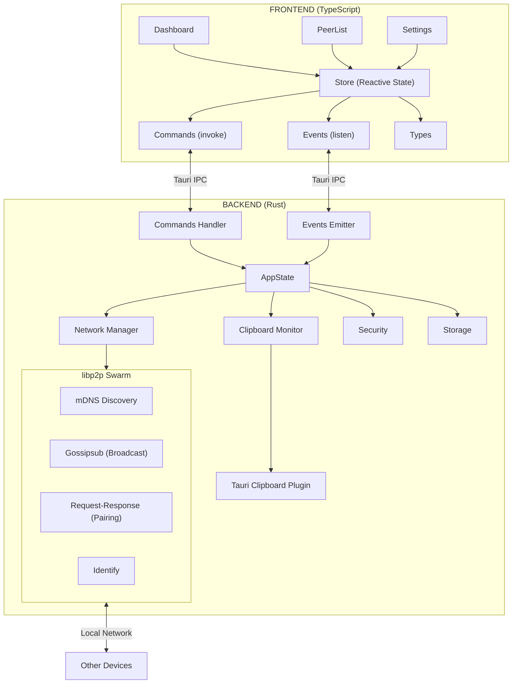
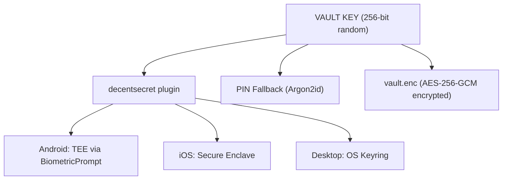
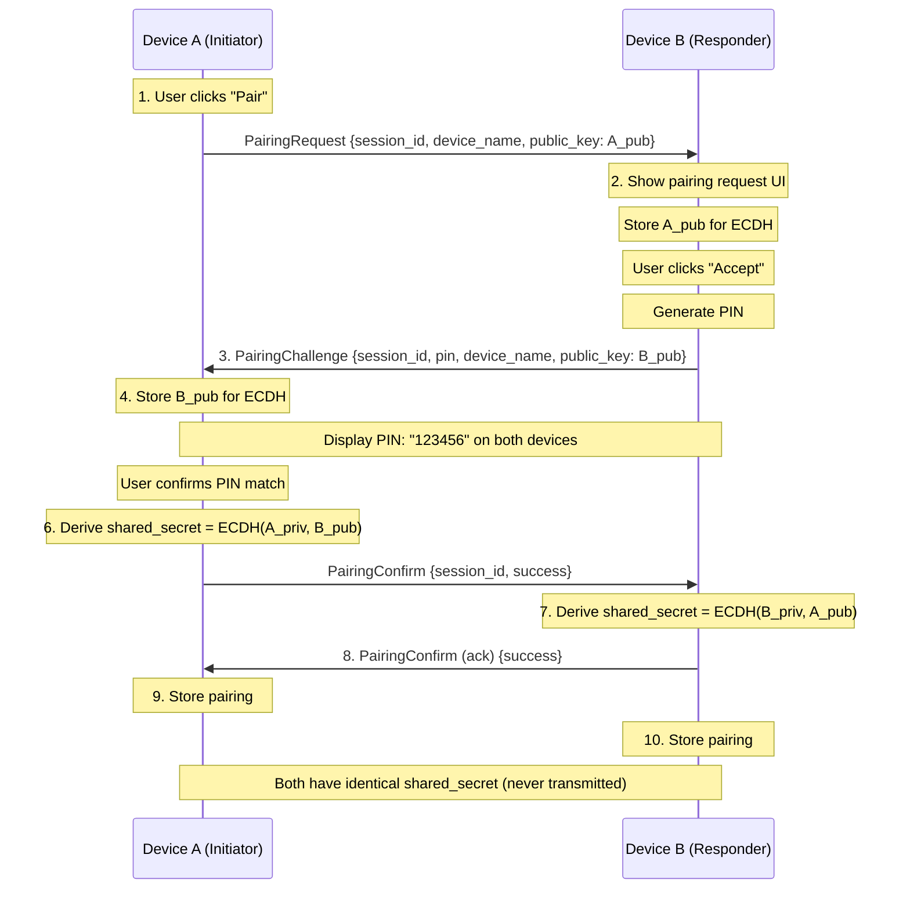
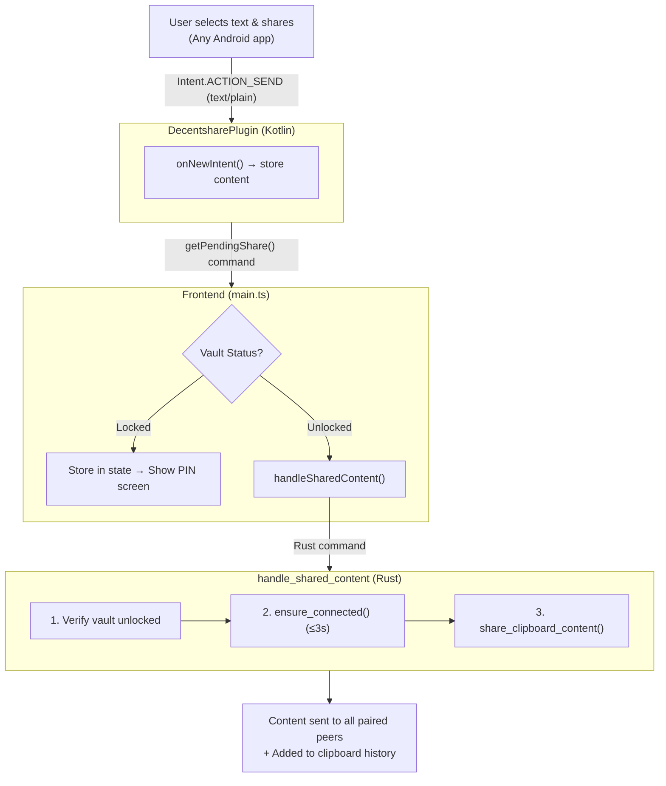

# DecentPaste - Architecture Documentation

This document describes the DecentPaste project architecture for AI agents and developers who will work on this
codebase.

## Project Overview

DecentPaste is a cross-platform clipboard sharing application that enables seamless clipboard synchronization between
devices over a local network. It works similarly to Apple's Universal Clipboard but supports all platforms (Windows,
macOS, Linux, Android, iOS).

### Key Features

- **Decentralized P2P networking** using libp2p (no central server)
- **Local network discovery** via mDNS
- **Secure clipboard sync** with AES-256-GCM encryption
- **PIN-based device pairing** for security
- **Automatic clipboard synchronization** when devices are paired
- **Auto-updates** via GitHub Releases (desktop only)

### Technology Stack

- **Backend**: Rust with Tauri v2
- **Frontend**: TypeScript with Tailwind CSS v4
- **Networking**: libp2p (mDNS, gossipsub, request-response)
- **Encryption**: AES-256-GCM, SHA-256
- **Key Exchange**: X25519 ECDH (Elliptic Curve Diffie-Hellman)
- **Secure Storage**: Hardware-backed (TEE/Keychain) via decentsecret, with Argon2id PIN fallback

---

## Directory Structure

```
decentpaste/
├── Cargo.toml                    # Workspace root
├── Cargo.lock
├── ARCHITECTURE.md               # This file
├── .github/
│   └── workflows/
│       └── release.yml           # CI/CD for building releases
└── decentpaste-app/              # Main Tauri application
    ├── package.json              # Frontend dependencies
    ├── tsconfig.json
    ├── vite.config.ts
    ├── postcss.config.js
    ├── index.html                # App entry HTML
    ├── tauri-plugin-decentshare/ # Android/iOS "share with" plugin
    │   ├── Cargo.toml            # Plugin Rust dependencies
    │   ├── src/                  # Plugin Rust code
    │   │   ├── lib.rs            # Plugin entry point
    │   │   ├── mobile.rs         # Mobile-specific (Android/iOS)
    │   │   ├── desktop.rs        # Desktop stub
    │   │   ├── commands.rs       # Plugin commands
    │   │   └── models.rs         # Shared types
    │   ├── android/              # Android Kotlin code
    │   │   └── src/main/java/DecentsharePlugin.kt
    │   └── guest-js/             # TypeScript bindings
    │       └── index.ts
    ├── tauri-plugin-decentsecret/ # Hardware-backed secure storage
    │   ├── Cargo.toml            # Plugin Rust dependencies
    │   ├── src/
    │   │   ├── lib.rs            # Plugin entry point
    │   │   ├── commands.rs       # Tauri commands
    │   │   ├── error.rs          # Error types
    │   │   ├── models.rs         # SecretStorageStatus, etc.
    │   │   ├── desktop.rs        # Keyring integration (keyring crate)
    │   │   └── mobile.rs         # Mobile bridge
    │   ├── android/              # BiometricPrompt + AndroidKeyStore
    │   │   └── src/main/java/DecentsecretPlugin.kt
    │   ├── ios/                  # Secure Enclave + LocalAuthentication
    │   │   └── Sources/DecentsecretPlugin.swift
    │   └── guest-js/
    │       └── index.ts
    ├── src/                      # Frontend TypeScript
    │   ├── main.ts               # Entry point + share intent handling
    │   ├── app.ts                # Main application logic & UI
    │   ├── styles.css            # Tailwind CSS
    │   ├── api/
    │   │   ├── types.ts          # TypeScript interfaces
    │   │   ├── commands.ts       # Tauri command wrappers
    │   │   ├── events.ts         # Event listener management
    │   │   └── updater.ts        # Auto-update logic
    │   ├── state/
    │   │   └── store.ts          # Reactive state store
    │   ├── components/
    │   │   └── icons.ts          # Lucide SVG icons
    │   └── utils/
    │       └── dom.ts            # DOM utilities
    └── src-tauri/                # Backend Rust
        ├── Cargo.toml            # Rust dependencies
        ├── tauri.conf.json       # Tauri configuration
        ├── capabilities/
        │   └── default.json      # Tauri permissions
        └── src/
            ├── main.rs           # Entry point
            ├── lib.rs            # Tauri app setup & initialization
            ├── commands.rs       # Tauri command handlers
            ├── state.rs          # Application state
            ├── error.rs          # Error types
            ├── network/          # libp2p networking
            │   ├── mod.rs
            │   ├── behaviour.rs  # Combined network behaviour
            │   ├── protocol.rs   # Message types
            │   ├── swarm.rs      # Network manager
            │   └── events.rs     # Network events
            ├── clipboard/        # Clipboard handling
            │   ├── mod.rs
            │   ├── monitor.rs    # Clipboard polling
            │   └── sync.rs       # Sync logic
            ├── security/         # Cryptography & pairing
            │   ├── mod.rs
            │   ├── crypto.rs     # AES-GCM encryption
            │   ├── identity.rs   # Device identity
            │   └── pairing.rs    # PIN pairing protocol
            ├── vault/            # Encrypted vault storage
            │   ├── mod.rs        # Module exports
            │   ├── auth.rs       # VaultStatus & AuthMethod enum
            │   ├── auth_persistence.rs  # Auth method file storage
            │   ├── error.rs      # Vault-specific error types
            │   ├── manager.rs    # VaultManager lifecycle & CRUD
            │   ├── salt.rs       # Installation-specific salt handling
            │   └── storage.rs    # VaultKey (zeroize) & VaultData types
            └── storage/          # Persistence
                ├── mod.rs
                ├── config.rs     # App settings
                └── peers.rs      # Data types & directory init
```

---

## Architecture Overview

### Data Flow



---

## Backend Components

### 1. Network Layer (`src/network/`)

#### `behaviour.rs` - DecentPasteBehaviour

Combined libp2p network behaviour with four sub-behaviours:

- **mDNS**: Automatic local network peer discovery
- **Gossipsub**: Pub/sub for broadcasting clipboard content to all paired peers
- **Request-Response**: Point-to-point messaging for pairing protocol
- **Identify**: Peer identification and metadata exchange

```rust
#[derive(NetworkBehaviour)]
pub struct DecentPasteBehaviour {
    pub mdns: mdns::tokio::Behaviour,
    pub gossipsub: gossipsub::Behaviour,
    pub request_response: request_response::Behaviour<DecentPasteCodec>,
    pub identify: identify::Behaviour,
}
```

#### `swarm.rs` - NetworkManager

Manages the libp2p swarm lifecycle:

- Accepts a persisted keypair for consistent PeerId across restarts
- Handles incoming network events (peer discovery, messages)
- Processes commands from the main app (send clipboard, initiate pairing)
- Maintains peer connection state (Connected/Connecting/Disconnected per peer)
- Filters out already-paired peers from discovery events
- **Connection tracking**: Per-peer status emitted to frontend via `peer-connection-status` events
- **Gossipsub optimization**: Adds peers to explicit peer list on connection for immediate mesh inclusion
- **Mobile support**: Handles `ReconnectPeers` command for app resume from background
- **Device name tracking**: Stores current device name and announces it on new connections
- **Peer refresh**: Re-emits discovered peers after unpairing so they can be paired again

#### `protocol.rs` - Message Types

Defines all protocol messages:

```rust
pub enum ProtocolMessage {
    Pairing(PairingMessage),        // Pairing flow messages
    Clipboard(ClipboardMessage),     // Encrypted clipboard content
    Heartbeat(HeartbeatMessage),     // Keep-alive
    DeviceAnnounce(DeviceAnnounceMessage), // Device name broadcasts
}
```

The `DeviceAnnounce` message is broadcast via gossipsub when:
- Device name changes in settings
- A new peer connects (to catch up peers that were offline)

### 2. Clipboard Layer (`src/clipboard/`)

#### `monitor.rs` - ClipboardMonitor

- Polls system clipboard every 500ms (configurable)
- Hashes content with SHA-256 to detect changes
- Emits `ClipboardChange` events when content changes

#### `sync.rs` - ClipboardEntry

- Defines `ClipboardEntry` struct (id, content, hash, timestamp, origin)
- Provides constructors for local vs remote entries
- Echo prevention is handled in `lib.rs` via `ClipboardMonitor.set_last_hash()`

### 3. Security Layer (`src/security/`)

#### `crypto.rs`

- `encrypt_content()` / `decrypt_content()` - AES-256-GCM encryption
- `hash_content()` - SHA-256 hashing for echo prevention and integrity verification

#### `identity.rs`

- Generates unique device identity with **X25519 keypair** on first run
- `derive_shared_secret()` - ECDH key derivation using X25519
- Stores device ID, name, and keypair (public + private)

#### `pairing.rs`

PIN-based pairing protocol with X25519 key exchange:

1. Device A initiates pairing, sends **public key** in request
2. Device B generates 6-digit PIN, responds with **own public key**
3. Both devices display PIN for visual verification
4. User confirms PIN matches on initiating device
5. Both devices independently derive the **same shared secret** using ECDH:
   - Device A: `shared = ECDH(A_private, B_public)`
   - Device B: `shared = ECDH(B_private, A_public)`
6. No secret is transmitted over the network - only public keys

### 4. Vault & Secure Storage (`src/vault/`)

The vault module provides AES-256-GCM encrypted storage for all sensitive data. The encryption key is protected using platform-native hardware security when available.

#### Architecture Overview



#### `auth.rs` - Authentication Types

```rust
pub enum VaultStatus {
    NotSetup,  // First-time user, needs onboarding
    Locked,    // Vault exists, requires unlock
    Unlocked,  // Vault open, data accessible
}

pub enum AuthMethod {
    SecureStorage,         // Hardware-backed (biometric on mobile, keyring on desktop)
    Pin,                   // Argon2id-derived key
    #[cfg(desktop)]
    SecureStorageWithPin,  // Desktop-only: Keychain + PIN (true 2FA)
}
```

#### `manager.rs` - VaultManager

Core vault lifecycle operations:

| Method                                 | Description                                        |
|----------------------------------------|----------------------------------------------------|
| `exists()`                             | Check if vault.enc file exists                     |
| `create_with_secure_storage()`         | Create vault with hardware-backed key              |
| `create_with_pin(pin)`                 | Create vault with Argon2id-derived key             |
| `create_with_secure_storage_and_pin()` | Desktop: Create vault with keychain + PIN (2FA)    |
| `open_with_secure_storage()`           | Unlock via biometric/keyring                       |
| `open_with_pin(pin)`                   | Unlock with PIN                                    |
| `open_with_secure_storage_and_pin()`   | Desktop: Decrypt keychain data with PIN, unlock    |
| `destroy()`                            | Delete vault, salt, and secure storage key         |
| `flush()`                              | Save in-memory data to encrypted file              |
| `lock()`                               | Flush and zeroize encryption key from memory       |

Data operations:
- `get_clipboard_history()` / `set_clipboard_history()`
- `get_paired_peers()` / `set_paired_peers()`
- `get_device_identity()` / `set_device_identity()`
- `get_libp2p_keypair()` / `set_libp2p_keypair()`

#### `storage.rs` - Secure Memory Types

- `VaultKey` - 256-bit key with `Zeroize` derive (cleared on drop)
- `VaultData` - Serializable vault contents
- `EncryptedVaultKeyData` - Desktop-only struct for keychain + PIN mode:
  - `version: u8` - Format version for future upgrades
  - `salt: [u8; 16]` - Argon2id salt for PIN key derivation
  - `nonce: [u8; 12]` - AES-GCM nonce for vault key encryption
  - `ciphertext: Vec<u8>` - Encrypted vault key (32 bytes) + auth tag (16 bytes)

#### `auth_persistence.rs` - Auth Method Storage

- Stores chosen auth method in `auth-method.json`
- Used at unlock to determine biometric vs PIN flow

#### `salt.rs` - Salt Management (PIN mode only)

- `get_or_create_salt()` - Returns 16-byte cryptographic salt
- `delete_salt()` - Removes salt file during vault destruction

#### Flush-on-Write Pattern

Data is persisted immediately after every mutation (flush-on-write), ensuring no data loss even on unexpected termination (crashes, force quit, macOS Cmd+Q):

| Mutation                  | Flush Method                          | Trigger   |
|---------------------------|---------------------------------------|-----------|
| Peer paired/unpaired      | `AppState::flush_paired_peers()`      | Immediate |
| Peer name updated         | `AppState::flush_paired_peers()`      | Immediate |
| Device name changed       | `AppState::flush_device_identity()`   | Immediate |
| Clipboard entry added     | `AppState::flush_clipboard_history()` | Immediate |
| Clipboard history cleared | `AppState::flush_clipboard_history()` | Immediate |

**Safety Net Flushes** (redundant but defensive):
- **App backgrounded (mobile)** - `flush_all_to_vault()` via `Focused(false)` event
- **App exit (all platforms)** - `flush_all_to_vault()` via `ExitRequested` event
- **Manual lock** - `flush_all_to_vault()` before clearing encryption key

#### Security Properties

- **Hardware-backed keys** - Mobile keys stored in TEE/Secure Enclave (never extractable)
- **Zeroize on drop** - Vault key securely cleared from memory when locked
- **Biometric binding** - Mobile keys invalidated if biometric enrollment changes
- **Per-installation salt** - Prevents rainbow table attacks (PIN mode)
- **Argon2id parameters** - 64 MB memory, 3 iterations (PIN mode)
- **Desktop 2FA** - SecureStorageWithPin combines keychain access + PIN knowledge

#### Platform Auth Methods

| Platform | Keychain Available | Default Auth Method                   |
|----------|--------------------|---------------------------------------|
| Desktop  | Yes                | SecureStorageWithPin (keychain + PIN) |
| Desktop  | No                 | Pin (fallback)                        |
| Mobile   | Yes                | SecureStorage (biometrics)            |
| Mobile   | No                 | Pin (fallback)                        |

#### Migration Screen Pattern

When introducing breaking changes that require existing users to reset their vault or take action, the app uses a migration screen pattern:

1. **Detection**: In `render()`, before showing normal UI, check if migration is required
2. **Block Access**: Show migration screen instead of normal lock screen / main app
3. **Clear Action**: Provide a single button to perform the migration (e.g., "Reset & Upgrade")
4. **Automatic Transition**: After migration, app automatically proceeds to the appropriate screen

**Implementation:**
- Add detection logic in `render()` method
- Create `renderMigrationRequired()` or similar method for the migration UI
- Add click handler for the migration action button
- Migration screen should explain what's changing and what user needs to do

**Example (SecureStorageWithPin migration):**
- Detected: `authMethod === 'secure_storage' && isDesktop()`
- Action: Reset vault, proceed to onboarding with new auth method
- Screen: "Security Upgrade Required" with "Reset & Upgrade" button

This pattern ensures:
- Users cannot bypass the migration
- Clear communication about what's happening
- Consistent UX for future breaking changes

### 5. Storage Layer (`src/storage/`)

#### `config.rs` - AppSettings

```rust
pub struct AppSettings {
    pub device_name: String,
    pub auto_sync_enabled: bool,
    pub clipboard_history_limit: usize,
    pub keep_history: bool,              // Persist clipboard history in vault
    pub show_notifications: bool,        // Desktop only; mobile is always silent
    pub clipboard_poll_interval_ms: u64,
    pub auth_method: Option<String>,     // "pin" (stored for UI preference)
    pub hide_clipboard_content: bool,    // Privacy mode - mask content in UI
    pub auto_lock_minutes: u32,          // Auto-lock vault after inactivity (0 = never)
}
```

**Mobile Background Behavior (Android & iOS):**
- **Clipboard sync**: Only works when app is in foreground; connections drop when backgrounded
- **Pairing requests**: Require the app to be open on both devices (no background notifications possible)

Note: Both Android and iOS terminate network connections when the app is backgrounded. This is a fundamental platform limitation that cannot be worked around without a central relay server (which would defeat the decentralized architecture). When the app resumes, it automatically reconnects to peers.

#### `peers.rs` - Types & Data Directory

Defines data structures and directory management:

- `DeviceIdentity` - Device ID, name, X25519 keypair
- `PairedPeer` - Peer ID, device name, shared secret, timestamps
- `init_data_dir()` - Initialize app data directory via Tauri
- `get_data_dir()` - Get path to app data directory

**Note**: All sensitive data (paired peers, device identity, libp2p keypair) is stored exclusively in the encrypted vault (`vault.hold`). No plaintext JSON files are used for sensitive data.

### 6. Commands (`src/commands.rs`)

Tauri commands exposed to frontend:

| Command                            | Description                                                                     |
|------------------------------------|---------------------------------------------------------------------------------|
| `get_network_status`               | Get current network status                                                      |
| `get_discovered_peers`             | List discovered devices (excludes already-paired devices)                       |
| `get_paired_peers`                 | List paired devices                                                             |
| `remove_paired_peer`               | Unpair a device (re-emits as discovered if still online)                        |
| `initiate_pairing`                 | Start pairing with a peer                                                       |
| `respond_to_pairing`               | Accept/reject incoming pairing request                                          |
| `confirm_pairing`                  | Confirm PIN match after user verification                                       |
| `cancel_pairing`                   | Cancel an active pairing session                                                |
| `get_clipboard_history`            | Get clipboard history                                                           |
| `set_clipboard`                    | Set clipboard content                                                           |
| `clear_clipboard_history`          | Clear all clipboard history                                                     |
| `reconnect_peers`                  | Trigger reconnection to disconnected peers (for mobile background resume)       |
| `refresh_connections`              | Awaitable reconnection, returns `ConnectionSummary` with connected/failed count |
| `get_settings` / `update_settings` | Manage app settings (broadcasts device name change)                             |
| `get_device_info`                  | Get this device's info                                                          |
| `get_pairing_sessions`             | Get active pairing sessions                                                     |
| `get_vault_status`                 | Get current vault state (NotSetup/Locked/Unlocked)                              |
| `setup_vault`                      | Create new vault during onboarding (device_name, pin)                           |
| `unlock_vault`                     | Unlock existing vault with PIN                                                  |
| `lock_vault`                       | Flush data and lock vault                                                       |
| `reset_vault`                      | Destroy vault and all data (factory reset)                                      |
| `flush_vault`                      | Force save vault data to disk                                                   |
| `process_pending_clipboard`        | Process clipboard queued while app was backgrounded                             |
| `handle_shared_content`            | Handle text shared from Android share sheet (awaits peers ≤3s, shares)          |

### 7. Events (Emitted to Frontend)

| Event                    | Payload                           | Description                                                       |
|--------------------------|-----------------------------------|-------------------------------------------------------------------|
| `network-status`         | `NetworkStatus`                   | Network state changed                                             |
| `peer-discovered`        | `DiscoveredPeer`                  | New peer found                                                    |
| `peer-lost`              | `string` (peer_id)                | Peer went offline                                                 |
| `peer-name-updated`      | `{peerId, deviceName}`            | Peer's device name changed (via DeviceAnnounce)                   |
| `peer-connection-status` | `{peer_id, status}`               | Peer connection state changed (connected/connecting/disconnected) |
| `clipboard-received`     | `ClipboardEntry`                  | Clipboard from peer                                               |
| `pairing-request`        | `{sessionId, peerId, deviceName}` | Incoming pairing request                                          |
| `pairing-pin`            | `{sessionId, pin}`                | PIN ready to display                                              |
| `pairing-complete`       | `{sessionId, peerId, deviceName}` | Pairing succeeded                                                 |
| `vault-status`           | `VaultStatus`                     | Vault state changed (NotSetup/Locked/Unlocked)                    |
| `settings-changed`       | `{auto_sync_enabled?: boolean}`   | Settings changed from system tray                                 |

---

## Frontend Components

### State Management (`src/state/store.ts`)

Simple reactive store with subscriptions:

```typescript
interface AppState {
    networkStatus: NetworkStatus;
    vaultStatus: VaultStatus;       // NotSetup | Locked | Unlocked
    discoveredPeers: DiscoveredPeer[];
    pairedPeers: PairedPeer[];
    clipboardHistory: ClipboardEntry[];
    currentView: 'dashboard' | 'peers' | 'settings';
    settings: AppSettings;
    deviceInfo: DeviceInfo | null;
    // Per-peer connection status for UI indicators
    peerConnections: Map<string, 'connected' | 'connecting' | 'disconnected'>;
    // Onboarding state
    onboardingStep: 'device-name' | 'pin-setup' | null;
    onboardingDeviceName: string;
    // ... UI state
}
```

### Views (`src/app.ts`)

Single-file application with authentication and main views:

**Authentication (before main app):**
- **Onboarding**: First-time setup wizard (device name → PIN setup)
- **Lock Screen**: PIN input for returning users, "Forgot PIN?" reset option

**Main Views (after unlock):**
1. **Dashboard**: Auto Sync toggle, paired devices shortcut, and clipboard history
2. **Peers**: Discovered and paired devices, pairing UI
3. **Settings**: Device name, notifications, history settings, security (auto-lock), lock button

### API Layer (`src/api/`)

- `commands.ts`: Typed wrappers for all Tauri commands
- `events.ts`: Event listener management with typed handlers
- `types.ts`: TypeScript interfaces matching Rust types

### Entry Point (`src/main.ts`)

- Initializes the app on DOMContentLoaded
- **Mobile background handling**: Listens for `visibilitychange` events and triggers `reconnectPeers()` when app becomes
  visible (critical for mobile where connections drop when backgrounded)
- **Android share intent handling**: Checks for pending shared content from `tauri-plugin-decentshare` on app init and
  visibility changes. If vault is locked, stores content for processing after unlock.

---

## Key Concepts

### Clipboard Sync Flow

1. User copies text on Device A
2. ClipboardMonitor detects change (hash ≠ last_hash), updates last_hash
3. Content is encrypted separately for each paired peer
4. Encrypted messages broadcast via gossipsub
5. Device B receives message, verifies it's not from self (origin_device_id check)
6. Device B decrypts with shared secret, verifies hash
7. Device B's clipboard is updated, last_hash set to prevent echo

### Pairing Flow (with X25519 ECDH Key Exchange)



**Security**: Both devices derive the same shared secret **independently** using ECDH.
The secret is **never transmitted** — only public keys are exchanged. Even if the
network traffic is captured, an attacker cannot derive the secret without a private key.

### Encryption

- All clipboard content is encrypted before transmission
- Each paired device pair shares a unique 256-bit secret (derived via X25519 ECDH)
- AES-256-GCM provides authenticated encryption
- Content hash (SHA-256) is sent alongside for verification
- **Per-peer encryption**: Messages are encrypted separately for each paired peer using their specific shared secret

### Device Name Broadcasting

Device names are synchronized across peers through multiple channels:

**At Startup:**
- Device name is included in libp2p identify protocol's `agent_version` field
- Format: `decentpaste/<version>/<device_name>`
- Peers parsing identify can extract the custom device name

**On Settings Change:**
- When user changes device name in Settings, `update_settings` broadcasts a `DeviceAnnounce` message
- All connected peers receive it via gossipsub and update their peer lists (both discovered and paired)
- Peers also save the updated name to persistent storage

**On New Connection:**
- When a new peer connects, NetworkManager automatically broadcasts a `DeviceAnnounce` message
- This handles the case where:
  - Device A changes name while Device B is offline
  - Device B comes back online and connects
  - Device B immediately receives Device A's current name
- Ensures devices always have the latest name without requiring app restart

### Unpair → Rediscovery

When a paired device is unpaired:
1. `remove_paired_peer` command removes it from `paired_peers` storage
2. Sends `RefreshPeer` command to NetworkManager
3. NetworkManager checks if the peer is still in its `discovered_peers` cache
4. If found, re-emits a `PeerDiscovered` event
5. Frontend updates and shows the device in the "Discovered Devices" section
6. User can pair with the device again immediately without restart

### Android Share Intent ("Share With")

DecentPaste registers as a share target in Android's share sheet, allowing users to share text from any app directly to their paired devices.

**How It Works:**



**Plugin Architecture:**

The `tauri-plugin-decentshare` Tauri plugin handles Android-specific intent interception:

- **AndroidManifest.xml**: Registers an activity-alias with SEND intent filter
- **DecentsharePlugin.kt**: Kotlin plugin that overrides `onNewIntent()` to capture shared text
- **Command-based retrieval**: Frontend polls for pending shares via `getPendingShare()` to avoid race conditions

**Vault Integration:**

If the vault is locked when content is shared:
1. Content is stored in frontend state (`pendingShare`)
2. User sees lock screen with "Unlock to share" message
3. After PIN entry and vault unlock, `processPendingShare()` is called
4. Content is shared to all paired peers automatically

**Event-Driven Peer Connection:**

The Rust `handle_shared_content` command uses `ensure_connected()`:
1. Guards against concurrent reconnection attempts (only one at a time)
2. Identifies disconnected peers and marks them as "Connecting"
3. Dials disconnected peers, waits via `tokio::sync::Notify` (no polling)
4. Returns when all dials complete or 3s timeout
5. Provides honest feedback: "Sent to 2/3. 1 offline." (gossipsub doesn't queue for offline peers)

### Auto-Updates

DecentPaste supports automatic updates on desktop platforms using Tauri's updater plugin with GitHub Releases.

**Update Flow:**
1. App checks `latest.json` from GitHub Releases every 60 seconds
2. If new version available, orange badge appears on Settings nav
3. User sees "Update available!" card with version info and release notes
4. User clicks "Download & Install" → progress bar shows download progress
5. Download completes → app restarts automatically to apply update

**Platform-Specific Targets:**

The updater dynamically selects the correct artifact based on how the app was installed:

| Platform | Bundle Type | Target Key                          |
|----------|-------------|-------------------------------------|
| Linux    | .deb        | `linux-x86_64-deb`                  |
| Linux    | .rpm        | `linux-x86_64-rpm`                  |
| Linux    | AppImage    | `linux-x86_64-appimage`             |
| Windows  | MSI         | `windows-x86_64-msi`                |
| Windows  | NSIS        | `windows-x86_64-nsis`               |
| macOS    | .app        | `darwin-aarch64` or `darwin-x86_64` |

This is achieved using Tauri's APIs:
- `platform()` and `arch()` from `@tauri-apps/plugin-os`
- `getBundleType()` from `@tauri-apps/api/app` (bundle type is embedded in binary at build time)

**Architecture:**
- `src/api/updater.ts` - Frontend update logic (check, download, install, progress tracking, dynamic target selection)
- `src-tauri/tauri.conf.json` - Updater configuration (public key, endpoints)
- `.github/workflows/release.yml` - CI/CD workflow for building signed releases

**Security:**
- All release artifacts are cryptographically signed with a private key
- App verifies signatures using embedded public key before installing
- HTTPS enforced in production mode
- Private key stored as GitHub Secret, never committed to repo

**Release Process:**
```bash
# 1. Bump version in tauri.conf.json and package.json
# 2. Create and push git tag
git tag v0.2.0
git push origin main --tags
# 3. GitHub Action automatically:
#    - Builds for Windows, macOS (Intel + ARM), Linux
#    - Signs all artifacts
#    - Generates latest.json
#    - Publishes to GitHub Releases
```

---

## Configuration Files

### `src-tauri/tauri.conf.json`

- App metadata (name, version, identifier)
- Window configuration (size, title)
- Build commands
- Updater configuration (public key, endpoints, install mode)

### `src-tauri/capabilities/default.json`

- Tauri permissions for the main window
- Enables core events and opener plugin

### `postcss.config.js`

- Uses `@tailwindcss/postcss` for Tailwind v4

### Data Directory (`~/.local/share/com.decentpaste.application/`)

**Encrypted:**
- `vault.enc` - AES-256-GCM encrypted vault containing:
  - Paired peers with shared secrets
  - Clipboard history (if `keep_history` enabled)
  - Device identity (device_id, device_name, keys)
  - libp2p Ed25519 keypair for consistent PeerId

**Auth-related:**
- `auth-method.json` - Stores chosen auth method (SecureStorage or Pin)
- `salt.bin` - 16-byte cryptographic salt (only used in PIN mode)

**Plaintext:**
- `settings.json` - App settings (non-sensitive preferences)

---

## Development Commands

```bash
# Install dependencies
cd decentpaste-app
yarn install

# Run in development mode
yarn tauri dev

# Build for production
yarn tauri build

# Check Rust code
cd src-tauri && cargo check

# Build frontend only
yarn build
```

---

## Known Limitations & Future Work

1. **Text-only clipboard**: Currently only supports text. Images/files could be added.
2. **Local network only**: Uses mDNS, so devices must be on same network. Internet relay could be added.
3. **Mobile clipboard (outgoing)**: On Android/iOS, automatic clipboard monitoring is not supported. Users must use the system share sheet from any app to share directly (via `tauri-plugin-decentshare` - works on both Android and iOS)
4. **Mobile clipboard (incoming)**: Clipboard only syncs when the app is in foreground. Network connections drop when
   the app is backgrounded (same behavior on both Android and iOS).
5. **Device name in identify**: The identify protocol includes device name in `agent_version` field, which is
   cosmetic (for human readability) but not ideal. Custom TXT records in mDNS would be better but more complex.

---

## Troubleshooting

### Network Issues

- Check that devices are on the same local network
- Verify mDNS is not blocked by firewall
- Check network status in app UI

### Pairing Issues

- Ensure both devices have the app running
- Verify PIN matches exactly on both devices
- Check for pairing timeout (5 minutes)

### Clipboard Not Syncing

- Verify devices are paired (check Peers view)
- Ensure Auto Sync is enabled on Dashboard (Home tab)
- Check that content is text (images not supported)

---

## Dependencies

### Rust (Key Dependencies)

- `tauri` v2 - Application framework
- `libp2p` v0.56 - P2P networking
- `tauri-plugin-clipboard-manager` v2 - Cross-platform clipboard (including mobile)
- `tauri-plugin-updater` v2 - Auto-updates for desktop
- `tauri-plugin-process` v2 - App restart after update
- `tauri-plugin-os` v2 - Platform/architecture detection for updater targets
- `tauri-plugin-decentshare` (local) - Android/iOS share intent handling
- `tauri-plugin-decentsecret` (local) - Hardware-backed secure storage
- `argon2` v0.5 - Argon2id key derivation (PIN fallback)
- `aes-gcm` v0.10 - AES-256-GCM encryption
- `x25519-dalek` v2 - X25519 ECDH key exchange
- `zeroize` v1.7 - Secure memory clearing
- `keyring` v3 - Desktop OS keychain access
- `tokio` v1 - Async runtime

### Frontend (Key Dependencies)

- `@tauri-apps/api` v2 - Tauri JavaScript API
- `@tauri-apps/plugin-clipboard-manager` v2 - Clipboard access for mobile
- `@tauri-apps/plugin-updater` v2 - Auto-update UI
- `@tauri-apps/plugin-process` v2 - App restart
- `@tauri-apps/plugin-os` v2 - Platform/architecture detection
- `tauri-plugin-decentshare-api` (local) - Share intent JS bindings
- `tauri-plugin-decentsecret-api` (local) - Secure storage JS bindings
- `tailwindcss` v4 - CSS framework
- `lucide` - Icons (inline SVGs)
