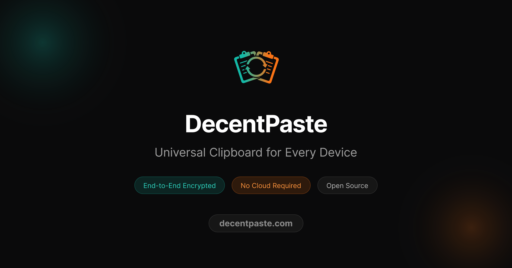

# DecentPaste

**Universal Clipboard for Every Device** — A cross-platform clipboard sharing app that works like Apple's Universal Clipboard, but for all platforms.

[](#project-status)
[](LICENSE)
[](https://tauri.app)
[](https://libp2p.io)

> 🚀 **Early Alpha** — Things may break and there could be security bugs. [Feedback welcome!](https://github.com/decentpaste/decentpaste/issues)

<p align="center">
  
</p>

## What is DecentPaste?

DecentPaste lets you seamlessly share your clipboard between all your devices over your local network. Copy on your laptop, paste on your phone. No cloud servers, no accounts, no subscriptions — just secure, peer-to-peer clipboard sync.

### Key Features

- **Cross-Platform** — Works on Windows, macOS, Linux, Android, and iOS
- **Decentralized** — No central server; devices connect directly via P2P
- **Auto-Discovery** — Devices find each other automatically on your local network
- **End-to-End Encrypted** — AES-256-GCM encryption; only paired devices can read your clipboard
- **Secure Pairing** — 6-digit PIN verification with X25519 key exchange
- **Lightweight** — Small binary size (~15MB) thanks to Tauri
- **Open Source** — Apache 2.0 licensed

## How It Works

1. **Discovery**: Devices find each other using mDNS
2. **Pairing**: One-time secure pairing with PIN verification establishes a shared secret
3. **Sync**: Clipboard changes are encrypted and broadcast to paired devices
4. **Receive**: Paired devices decrypt and update their clipboard automatically

## Installation

### Pre-built Binaries

Download the latest release for your platform:

| Platform | Download                                                                         |
|----------|----------------------------------------------------------------------------------|
| Windows  | [DecentPaste-x.x.x-windows](https://github.com/decentpaste/decentpaste/releases) |
| macOS    | [DecentPaste-x.x.x-macos](https://github.com/decentpaste/decentpaste/releases)   |
| Linux    | [DecentPaste-x.x.x-linux](https://github.com/decentpaste/decentpaste/releases)   |
| Android  | [DecentPaste-x.x.x-android](https://github.com/decentpaste/decentpaste/releases) |
| iOS      | Coming soon                                                                      |

### Build from Source

**Prerequisites:**
- [Rust](https://rustup.rs/) (1.70+)
- [Node.js](https://nodejs.org/) (18+)
- [Yarn](https://yarnpkg.com/)
- Platform-specific requirements for [Tauri](https://tauri.app/v2/guides/getting-started/prerequisites)

```bash
# Clone the repository
git clone https://github.com/decentpaste/decentpaste.git
cd decentpaste/decentpaste-app

# Install dependencies
yarn install

# Run in development mode
yarn tauri dev

# Build for production
yarn tauri build
```

## Usage

### Getting Started

1. **Install** DecentPaste on two or more devices
2. **Ensure** devices are on the same local network (Wi-Fi/LAN)
3. **Open** the app — devices will discover each other automatically
4. **Pair** devices using the 6-digit PIN (out-of-band MITM protection)
5. **Copy** on one device, **paste** on another!

### Pairing Devices

1. On Device A: Go to **Devices** → Click **Pair** next to the discovered device
2. On Device B: Accept the pairing request
3. Both devices display a **6-digit PIN** — verify they match
4. Confirm on Device A
5. Done! Devices are now paired and will sync automatically

### Mobile Usage

On Android, clipboard access is restricted for privacy. Two ways to share:

1. **Direct share** (easiest): Select text in any app → Share → Choose **DecentPaste**
   Sent directly to paired devices — no clipboard involved.

2. **Via clipboard**: Select text → Share → "Copy to clipboard" → Open DecentPaste → Tap **"Share Now"**

**Note**: Keep the app open on both devices during pairing (background connections are not supported).

## Security

> **📖 [Read the full Security Documentation →](SECURITY.md)**
>
> Includes architecture diagrams, threat model, and vulnerability reporting.

DecentPaste is designed with security as a priority:

| Layer            | Technology                 | Purpose                                   |
|------------------|----------------------------|-------------------------------------------|
| **Key Exchange** | X25519 ECDH                | Shared secrets derived, never transmitted |
| **Encryption**   | AES-256-GCM                | Authenticated encryption for clipboard    |
| **Storage**      | IOTA Stronghold + Argon2id | PIN-protected encrypted vault             |
| **Transport**    | libp2p Noise               | Encrypted P2P connections                 |

**Key security properties:**
- **Local-only**: Data never leaves your network (mDNS discovery)
- **Zero-knowledge pairing**: 6-digit PIN + ECDH key exchange
- **Per-peer encryption**: Each device pair has a unique key
- **Auto-lock**: Vault locks after configurable inactivity

## Tech Stack

| Component         | Technology                                                                                         |
|-------------------|----------------------------------------------------------------------------------------------------|
| **App Framework** | [Tauri v2](https://tauri.app)                                                                      |
| **Backend**       | Rust                                                                                               |
| **Frontend**      | TypeScript + [Tailwind CSS v4](https://tailwindcss.com)                                            |
| **Networking**    | [libp2p](https://libp2p.io) (mDNS, gossipsub, request-response)                                    |
| **Encryption**    | [aes-gcm](https://crates.io/crates/aes-gcm), [x25519-dalek](https://crates.io/crates/x25519-dalek) |

## Development

### Running Two Instances (Testing)

```bash
# Terminal 1 - desktop
cd decentpaste-app
yarn tauri dev

# Terminal 2 - android
yarn tauri android dev

# Terminal 3 - iOS
yarn tauri ios dev
```

### Architecture Documentation

See [ARCHITECTURE.md](ARCHITECTURE.md) for detailed technical documentation.

## Project Status

**DecentPaste is currently in Alpha.** Here's what that means:

| Aspect                    | Status                                                    |
|---------------------------|-----------------------------------------------------------|
| **Core functionality**    | ✅ Works reliably for daily use                            |
| **Security fundamentals** | ✅ Sound cryptography (X25519 ECDH, AES-256-GCM, Argon2id) |
| **Local-only design**     | ✅ Data never leaves your network                          |
| **Security hardening**    | 🔄 Ongoing (community review welcome)                     |
| **Production readiness**  | ⚠️ Not yet recommended for highly sensitive data          |

**What I'd recommend:**
- ✅ Great for: URLs, code snippets, notes, general text
- ⚠️ Caution with: Passwords, API keys, financial data (use a password manager instead)

The local-only (mDNS) design significantly limits the attack surface compared to cloud-based alternatives. If you find security issues, please [open an issue](https://github.com/decentpaste/decentpaste/issues) — I take them seriously and respond promptly.

## Roadmap

- [ ] Image and file clipboard support
- [ ] Internet relay for cross-network sync (leverages libp2p Kademlia DHT)
- [ ] Leverage platform-native secure authentication instead of PIN-based vault encryption (CTAP/FIDO2/TPM)
- [ ] Zeroization: Key cleared from memory on lock
- [x] Encrypted vault storage (IOTA Stronghold)
- [x] Persistent clipboard history
- [x] System tray improvements

## Contributing

Contributions are welcome! Please read our contributing guidelines before submitting PRs.

1. Fork the repository
2. Create a feature branch (`git checkout -b feature/amazing-feature`)
3. Commit your changes (`git commit -m 'use conventional commits'`)
4. Push to the branch (`git push origin feature/amazing-feature`)
5. Open a Pull Request

## License

This project is licensed under the **Apache License 2.0** — see the [LICENSE](LICENSE) file for details.

### Trademark

"DecentPaste" and the DecentPaste logo are trademarks. See [TRADEMARK.md](TRADEMARK.md) for usage guidelines.

**Note**: The Apache 2.0 license grants rights to the code but does not grant rights to use the DecentPaste trademarks or logos.

## Acknowledgments

- [Tauri](https://tauri.app) — For the amazing cross-platform framework
- [libp2p](https://libp2p.io) — For decentralized networking
- [RustCrypto](https://github.com/RustCrypto) — For cryptographic primitives

---

<p align="center">
  <b>DecentPaste</b> — Your clipboard, everywhere.
  <br>
  <a href="https://github.com/decentpaste/decentpaste">GitHub</a> ·
  <a href="https://github.com/decentpaste/decentpaste/issues">Issues</a> ·
  <a href="https://github.com/decentpaste/decentpaste/releases">Releases</a>
</p>
