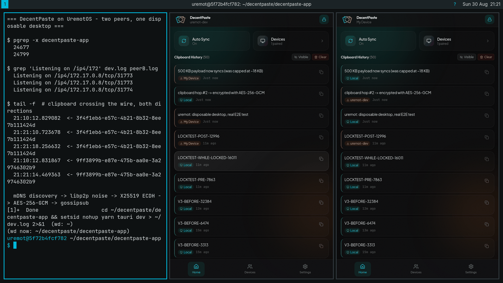
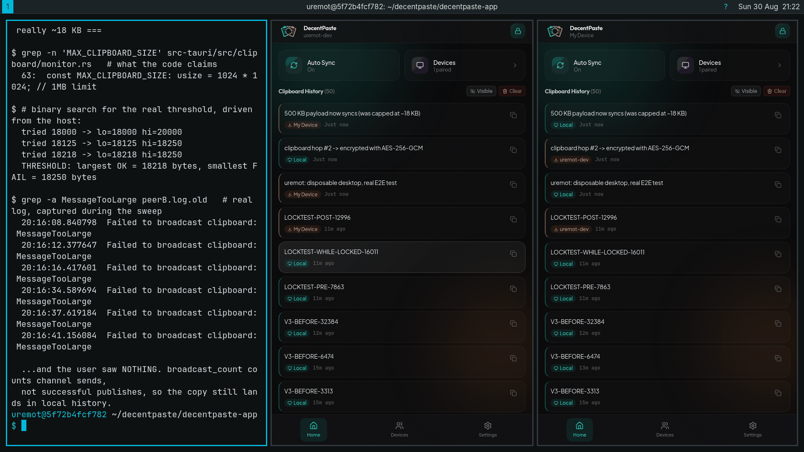
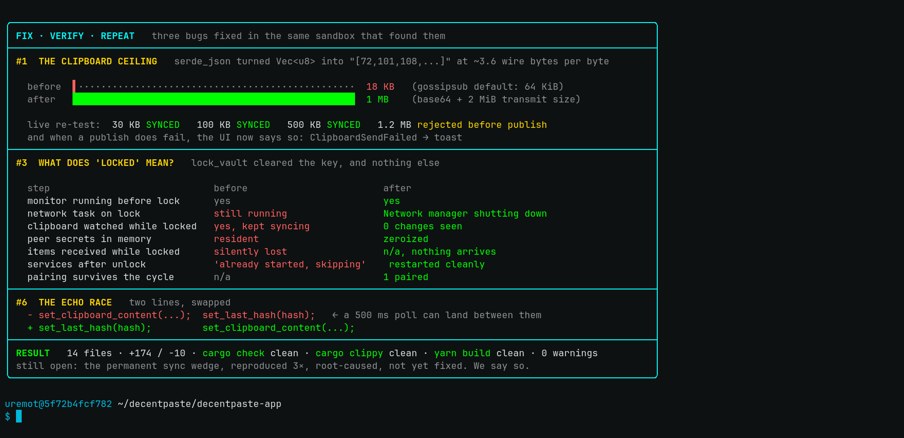
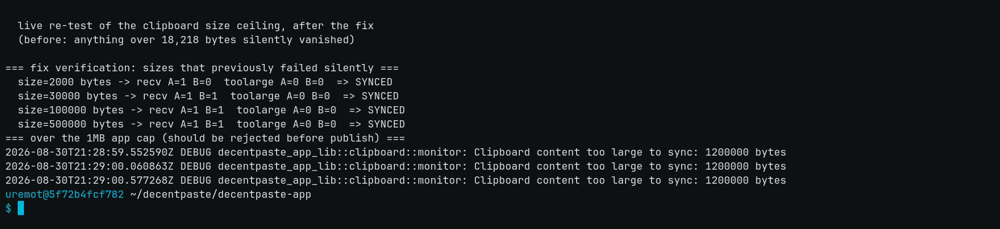
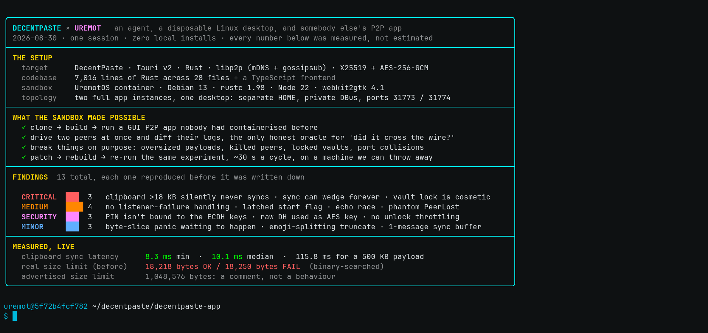

# Notes from a disposable desktop

*An agent, a throwaway Linux box, and somebody else's P2P clipboard app.*

**The pull request that came out of this run: [decentpaste/decentpaste#51](https://github.com/decentpaste/decentpaste/pull/51).**
Four commits, thirteen findings, and one bug that is still open.

---

DecentPaste is Universal Clipboard for everything that isn't an iPhone. Copy on your laptop,
paste on your phone. mDNS finds the other device, X25519 agrees on a key, AES-256-GCM encrypts
the payload once per peer, and gossipsub moves the bytes. About 7,000 lines of Rust behind a
Tauri v2 shell.

The catch is that almost none of the interesting behaviour lives inside a single process. A unit
test can prove `encrypt_content` round-trips. It cannot tell you whether a clipboard entry
actually crossed the wire, arrived intact, and got attributed to the right device. For that you
need two real peers, and ideally you need permission to be horrible to them.

So the app ran twice, inside one disposable [uremot](https://uremot.com) desktop instance. Not
mocks and not a test harness: two full GUI instances with separate vaults, separate libp2p
identities, talking over real TCP. Clone, build, pair, break on purpose, fix, verify, all in the
same box, and then throw the box away.



*Left: the shell driving the test. Middle and right: two independent DecentPaste instances.
The badges are the whole trick. `Local` means the entry originated on that device; a device-name
badge means it arrived from the peer. That is the only honest proof anything crossed the network,
because both windows are watching the same X11 clipboard.*

## Three isolations, none of them obvious

Getting two instances to coexist on one desktop took three separate tricks, and each one first
showed up looking like a different bug.

**Separate vault.** `HOME=/path/to/peerB`. Each vault holds its own libp2p keypair, so the peer
IDs differ. Share a HOME and you have one device talking to itself.

**Separate DBus session.** `dbus-run-session --`. `tauri-plugin-single-instance` claims a
session-bus name from the app identifier, so the second instance politely raises the first
window and exits. A private bus sidesteps it with no code change.

**Separate port.** The listener is hardcoded:

```rust
// network/swarm.rs:173
// Use a fixed port (31773) so cached addresses remain valid across app restarts.
let listen_addr: Multiaddr = "/ip4/0.0.0.0/tcp/31773".parse().unwrap();
```

Two instances fight over one socket, and the symptom is `Dial error: Unexpected peer ID`, which
looks convincingly like a crypto bug for about twenty minutes.

That last one is a deliberate design decision (a fixed port keeps cached peer addresses valid
across restarts), so the port override stayed test scaffolding and never went into the PR.

```bash
# peer B, alongside a normally launched peer A
setsid env HOME=~/peerB DECENTPASTE_P2P_PORT=31774 DISPLAY=:99.0 RUST_LOG=debug \
  dbus-run-session -- ./target/debug/decentpaste-app > peerB.log 2>&1 &
```

## The 1MB limit that was really 18KB

Two places in the codebase promise a one-megabyte clipboard:

```rust
// clipboard/monitor.rs:63  and  commands.rs:1317
const MAX_CLIPBOARD_SIZE: usize = 1024 * 1024; // 1MB limit
```

A binary search against the two live peers put the real ceiling somewhere between eighteen and
nineteen kilobytes. Narrowed down:

```
tried 18000 -> lo=18000 hi=20000
tried 18125 -> lo=18125 hi=18250
tried 18218 -> lo=18218 hi=18250
THRESHOLD: largest OK = 18,218 bytes, smallest FAIL = 18,250 bytes
```

Two things multiply into that number. gossipsub's default `max_transmit_size` is 64KiB and
nobody had raised it. And `serde_json` renders a `Vec<u8>` as a JSON array of decimal numbers,
`[72,101,108,108,111]`, which costs roughly 3.6 wire bytes for every payload byte. 65536 divided
by 3.6 runs out right around 18.2KB.

The arithmetic isn't really the bug though. This is:

```rust
// lib.rs, before
if let Err(e) = network_cmd_tx.send(BroadcastClipboard { .. }).await {
    error!("Failed to send clipboard to network: {}", e);
} else {
    broadcast_count += 1;   // counts the channel send, not the publish
}
...
if broadcast_count > 0 {
    // entry added to history, `clipboard-sent` emitted, so it looks synced
}
```

The publish happens later, over in the swarm task, where a failure was a `warn!` and nothing
else. So the copy landed in your history, the app said nothing at all, and the bytes never left
the machine. Copy a long log file to send to a colleague, glance at the history, see it sitting
there, and it is not on the other device.



*Six real `MessageTooLarge` warnings from the peer's own log during the size sweep. That warning
line was the app's entire response to a clipboard entry that never made it out of the building.*

## "Locked" turned out to be a picture of a padlock

Both vaults auto-locked while I was reading something else. The lock screens came up. Out of
idle curiosity I set the clipboard anyway.

```
20:15:39.573  B  Clipboard content changed, hash: c2266fa0
20:15:39.575  B  Broadcast clipboard message: 52e6b67f-...
20:15:39.583  A  Received clipboard message from 3f4f1eb6-...
20:15:39.583  A  WARN Cannot flush clipboard history: vault not open
```

Peer A received and decrypted clipboard content behind its own lock screen, in four
milliseconds.

`lock_vault` cleared the vault encryption key and nothing else. Unlike `reset_vault` sitting
right below it, it left the per-peer AES-256 shared secrets, the X25519 private key and the
whole plaintext clipboard history resident in memory, and it never stopped the network or
clipboard tasks. The lock screen was functionally a screensaver.

That `WARN` on the last line is a second bug wearing the first one's coat. Flushing needs an open
vault, so everything that arrived while locked lived in RAM and died on exit. After one
lock-and-restart cycle, twelve minutes of clipboard history was gone, with no error anywhere a
user would ever look.

## The one I couldn't fix

Somewhere in the middle of the size sweep the two peers stopped talking. They didn't disconnect.
They just stopped delivering, and they never started again.

```
A: Broadcast clipboard message: 250a358e-...      <- app thinks it sent
   libp2p: Published message message_id=...       <- libp2p thinks it sent
B: (nothing)                                      <- never arrives
   yamux::connection::rtt: received pong          <- TCP is alive
   Identified peer ...: decentpaste/0.8.1/uremot-dev
   HEARTBEAT: Mesh low. Topic contains: 0 needs: 6
   Peer couldn't consume messages: FailedMessages { publish: 1, timeout: 1 }
A: WARN Peer 12D3KooW...subrnw is slow
```

Reproduced deterministically three times. It survives ten minutes and dozens of probes. Only
restarting the app brings sync back. The app's entire response to `gossipsub::Event::SlowPeer` is
one `warn!` and no action (`swarm.rs:405`).

I had a theory: the two sides' topic-subscription state diverges, so re-add the explicit peer and
force a re-subscribe. I wrote it, rebuilt, re-ran the burst, and delivery stayed dead. Which is
the deflating but useful outcome. A fix I built and tested did not work, so it is not in the PR.
The finding ships with its evidence and an admission that the remedy is still open.

Being able to say "reproduced three times, root-caused to here, candidate fix tested and
rejected" beats a confident patch that quietly does nothing.

## Fix, verify, repeat, in the same box

The good part about breaking someone else's app inside a container you can throw away is that the
loop is about thirty seconds long: patch, `cargo build`, relaunch both peers, re-run the exact
experiment that failed.

Base64 instead of a JSON number array takes the wire cost from about 3.6 bytes per byte down to
about 1.34. Raising `max_transmit_size` to 2MiB makes the advertised megabyte real. And a new
`ClipboardSendFailed` event means a publish that fails now reaches the user as a toast instead of
a log line nobody reads.

```rust
/// Serializes `Vec<u8>` as a base64 string rather than a JSON array of decimal numbers.
/// The array form costs ~3.6 wire bytes per payload byte; base64 costs ~1.34.
mod base64_bytes { /* ... */ }

#[serde(with = "base64_bytes")]
pub encrypted_content: Vec<u8>,
```



*Before and after for each of the three fixes. The lock table in the middle is the one that
matters: the clipboard monitor now sees zero changes while locked, the peer secrets are
zeroized, and the pairing still survives the cycle.*



*The same script that found the ceiling, run again after the fix. 30KB, 100KB and 500KB now
cross. 1.2MB is refused before publish instead of silently vanishing.*

Measured sync latency afterwards: 8.3ms fastest, 10.1ms median, and 115.8ms for a 500KB payload.

### The mistake I made in my own fix

The first version of the vault-lock fix cleared the in-memory state (peer secrets, history,
pairings) and *then* closed the vault. Which means a flush racing that teardown would happily
persist the emptied lists and destroy the user's pairings. I caught it because the next test run
showed zero paired peers and I went looking.

Closing the vault first makes every later flush a no-op, so the clear physically cannot be
written back. Teardown paths deserve the same ordering paranoia as setup paths, and I did not
give it to them the first time.

That was not the only one. Re-reading the pull request after opening it, I found that the echo-race
fix had only landed on one of two call sites. `set_last_hash` is also called by the handler that
applies clipboard items recovered by offline sync, and that one still wrote the system clipboard
before registering the hash. Identical race, just rarer, because finding 13 keeps that path from
carrying much traffic. It took a fourth commit. The live test run never caught it, because the
experiments I ran only ever exercised the gossipsub receive path, which is a fair reminder that
"reproduced and verified" covers the path you tested and nothing else.

## What shipped

Four commits, each independently readable:

| commit | what |
|---|---|
| [`79c6976`](https://github.com/decentpaste/decentpaste/pull/51/commits/79c6976) | `fix(network): make the advertised 1MB clipboard limit real` |
| [`4632d14`](https://github.com/decentpaste/decentpaste/pull/51/commits/4632d14) | `fix(clipboard): register echo guard before writing the clipboard` |
| [`71bf757`](https://github.com/decentpaste/decentpaste/pull/51/commits/71bf757) | `fix(vault): stop syncing and wipe key material when the vault locks` |
| [`3d53510`](https://github.com/decentpaste/decentpaste/pull/51/commits/3d53510) | `fix(clipboard): apply the echo guard to the offline-sync path too` |

14 files, +174/-10. `cargo check`, `cargo clippy` and `yarn build` all clean, zero warnings.

**Read the full thing here: [decentpaste/decentpaste#51](https://github.com/decentpaste/decentpaste/pull/51)**,
including the log evidence, the two things I want a second opinion on (the 2MiB transmit size is
a judgement call, and the base64 switch is a breaking wire-format change that probably deserves a
protocol version bump), and the reproduction recipe in the comments.

## All thirteen findings

Each one was reproduced before it was written down.



| # | Finding | Status |
|---|---|---|
| 1 | Clipboard over ~18KB silently never syncs, and the UI reports success | fixed |
| 3 | Vault lock doesn't stop sync, and everything received while locked is lost | fixed |
| 5 | `SERVICES_STARTED` never resets, so a dead network stack can never restart | fixed |
| 6 | Echo guard registered after the clipboard write instead of before | fixed |
| 2 | Sync wedges permanently between two connected peers | open |
| 4 | No `ListenerClosed` / `ListenerError` handling | open |
| 7 | `PeerLost` fires for peers that are still connected | open |
| 8 | Pairing PIN isn't bound to the ECDH keys, so no MITM protection | open |
| 9 | Raw X25519 DH output used directly as the AES-256 key | open |
| 10 | No unlock rate limiting, and the frontend accepts 4-digit PINs | open |
| 11 | `ClipboardEntry::preview` byte-slices a `String` and panics on a multibyte boundary | open |
| 12 | `truncate()` in `utils/dom.ts` splits emoji surrogate pairs | open |
| 13 | `SYNC_MAX_BUFFER_SIZE = 1` makes the hash-list sync protocol mostly theatrical | open |

Finding 8 is the one I would most want a real cryptographer to look at. The pairing PIN is a
random six-digit number:

```rust
// security/pairing.rs
pub fn generate_pin() -> String {
    let mut rng = rand::rng();
    let pin: u32 = rng.random_range(0..1_000_000);
    format!("{:06}", pin)
}
```

It gets transmitted inside `PairingChallenge` and displayed, and it is never bound to the ECDH
keys. A relaying attacker forwards the PIN unchanged, substitutes their own X25519 public keys,
and both users see matching digits and confirm. Proper numeric comparison (Bluetooth SSP, SAS)
derives those digits from a hash of *both* public keys, so a man in the middle produces different
numbers on the two screens. The telling detail: there is a `PairingResponse.pin_hash: Vec<u8>`
field sitting in `protocol.rs` that nothing anywhere reads or writes. The verification looks
designed, and then never implemented.

### Tested clean

Worth recording what did not break. UTF-8, emoji, ZWJ sequences and multiline text all
round-tripped byte-exact with SHA-256 verified on both ends. Both directions sync. Echo
prevention holds under normal timing. Consecutive duplicates dedupe. Oversized payloads get
rejected without corrupting state.

## What this doesn't prove

A few caveats, because the run was not a clean sweep.

Two peers on *one host* is not two devices on a real network. No Wi-Fi, no NAT, no mobile radio
falling asleep. mDNS across an actual LAN could behave quite differently, and the wedge in
finding 2 might look nothing like this in the wild.

The environment fought back. Peers intermittently failed the noise handshake on startup and
needed a restart. GUI automation dropped keystrokes until I gave up and drove `xdotool` directly.
A decent chunk of the session went into fighting my own tooling rather than the app.

Some of the better theories went nowhere. I was fairly confident the wedge came from messages
sitting just under the transmit limit; a clean experiment said no.

No automated tests were added, because the repo has none and these behaviours need two live
peers. The reproduction recipe is written down instead, which is a weaker artifact than a test
suite and I would rather say so than pretend otherwise.

What the disposable desktop actually bought was permission. Flooding a peer with 40KB payloads
until gossipsub falls over, killing a process mid-handshake, locking a vault to see what leaks:
these are things you do casually on a machine that costs nothing to destroy and nothing to
rebuild. On your own laptop you think twice, and thinking twice is how an 18KB ceiling survives
to version 0.8.1.

## Reproducing any of this

Both instances share one X11 clipboard on the same `DISPLAY`, so the UI alone cannot prove a
message crossed the network. Two things can: the logs (`Broadcast clipboard message` on the
sender, `Received clipboard message` on the receiver) and the history badge. Mark the line count
of both logs, act, then diff.

```bash
probe () {
  LA=$(wc -l < $A); LB=$(wc -l < $B)
  printf "%s" "$1" > /tmp/probe.txt; setclip.sh /tmp/probe.txt; sleep 4
  echo "A: sent=$(new $LA $A | grep -c 'Broadcast') recv=$(new $LA $A | grep -c 'Received')" \
       "| B: sent=$(new $LB $B | grep -c 'Broadcast') recv=$(new $LB $B | grep -c 'Received')"
}
```

One gotcha before any of that works. A fresh clone cannot build the frontend at all:

```
Failed to resolve entry for package "tauri-plugin-decentshare-api" [plugin vite:dep-scan]
```

`tauri-plugin-decentshare/.gitignore` ignores `dist-js/`, but that package's `package.json`
points `main`, `module` and `exports` at `./dist-js/index.js`. Only `guest-js/index.ts` is
tracked, so the entry point does not exist until rollup runs. Existing dev machines never hit
this because they have a stale `dist-js/` lying around.

```bash
cd decentpaste-app/tauri-plugin-decentshare && yarn install && yarn build
cd .. && rm -rf node_modules/tauri-plugin-decentshare-api && yarn install --force
```

That second step matters: Yarn Classic copies `file:` dependencies into `node_modules` rather
than symlinking them, so building at the source alone leaves the copy stale.

---

**Environment:** UremotOS container on Debian 13, rustc/cargo 1.98, Node 22.23, Yarn 1.22,
webkit2gtk-4.1 2.52. App under test: DecentPaste 0.8.1, Tauri v2, libp2p 0.56.

**Links:** [the pull request](https://github.com/decentpaste/decentpaste/pull/51) ·
[decentpaste/decentpaste](https://github.com/decentpaste/decentpaste) ·
[uremot](https://uremot.com)
