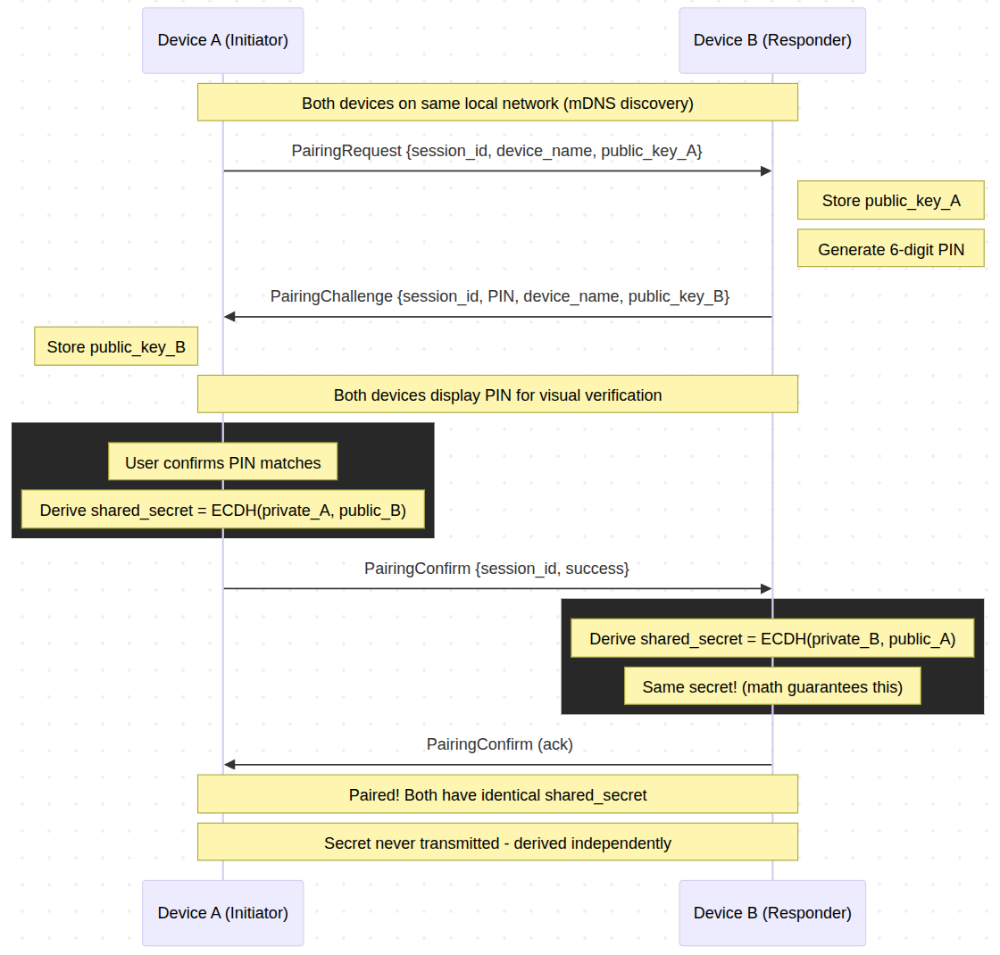
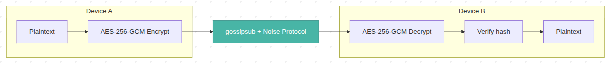
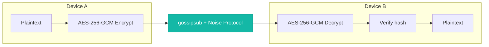

# Security

DecentPaste takes security seriously. This document describes the project security model, how it protects your data, and how to report vulnerabilities.

## Reporting Security Vulnerabilities

If you discover a security vulnerability, please report it responsibly:

1. **DO NOT** open a public GitHub issue for security vulnerabilities
2. Email security concerns to the maintainers via [GitHub private vulnerability reporting](https://github.com/decentpaste/decentpaste/security/advisories/new)
3. Include steps to reproduce and potential impact
4. Allow reasonable time for a fix before public disclosure

Project takes all reports seriously and will respond promptly.

---

## Security Architecture

### Cryptographic Stack

| Layer              | Technology      | Purpose                                            |
|--------------------|-----------------|----------------------------------------------------|
| **Key Exchange**   | X25519 ECDH     | Secure key derivation without transmitting secrets |
| **Encryption**     | AES-256-GCM     | Authenticated encryption for clipboard content     |
| **Hashing**        | SHA-256         | Echo prevention and integrity verification         |
| **Transport**      | libp2p Noise    | Encrypted peer-to-peer connections                 |
| **Key Derivation** | Argon2id        | PIN-to-key derivation with memory-hard function    |
| **Secure Storage** | IOTA Stronghold | Encrypted vault for secrets                        |

### Design Principles

- **Local-only by design**: Data never leaves your local network (mDNS discovery)
- **No cloud servers**: No central point of attack or data collection
- **Zero-knowledge pairing**: Shared secrets are derived, never transmitted
- **Per-peer encryption**: Each device pair has a unique encryption key

---

## Pairing Security (X25519 ECDH)

When two devices pair, they perform a Diffie-Hellman key exchange:

1. Devices exchange **public keys** (X25519)
2. Each device independently derives the **same shared secret** using ECDH
3. The shared secret is **never transmitted** — only public keys are exchanged
4. 6-digit PIN provides **visual verification** against MITM attacks
5. Each device pair has a **unique encryption key**

### Pairing Flow Diagram

```mermaid
sequenceDiagram
    participant A as Device A (Initiator)
    participant B as Device B (Responder)

    Note over A,B: Both devices on same local network (mDNS discovery)

    A->>B: PairingRequest {session_id, device_name, public_key_A}
    Note right of B: Store public_key_A
    Note right of B: Generate 6-digit PIN
    B->>A: PairingChallenge {session_id, PIN, device_name, public_key_B}
    Note left of A: Store public_key_B

    Note over A,B: Both devices display PIN for visual verification

    rect rgb(40, 40, 40)
        Note over A: User confirms PIN matches
        Note over A: Derive shared_secret = ECDH(private_A, public_B)
    end

    A->>B: PairingConfirm {session_id, success}

    rect rgb(40, 40, 40)
        Note over B: Derive shared_secret = ECDH(private_B, public_A)
        Note over B: Same secret! (math guarantees this)
    end

    B->>A: PairingConfirm (ack)

    Note over A,B: Paired! Both have identical shared_secret
    Note over A,B: Secret never transmitted - derived independently
```



<details>
<summary>Mermaid source</summary>



</details>

### Why This Is Secure

- **ECDH math**: Both parties compute `shared = their_private × peer_public`, which yields identical results
- **PIN verification**: Prevents MITM attacks where an attacker could intercept and substitute public keys
- **No secret transmission**: Even if network traffic is captured, the shared secret cannot be derived without a private key

---

## Clipboard Sync Security

### Encryption Flow



<details>
<summary>Mermaid source</summary>



</details>

### Per-Peer Encryption

Content is encrypted **separately for each paired peer** using their specific shared secret. This means:

- Peer A cannot decrypt messages intended for Peer B
- Compromising one pairing doesn't affect others
- Each relationship has cryptographic isolation

---

## Secure Vault Storage

All sensitive data is stored in an encrypted IOTA Stronghold vault:

```
User PIN (4-8 digits)
       │
       ▼
┌─────────────────────────┐
│      Argon2id KDF       │ ← salt.bin (unique per device)
│  m=64MB, t=3, p=4       │
└─────────────────────────┘
       │
       ▼
   256-bit Key → vault.hold (encrypted)
```

### What's Protected

| Data                          | Purpose                              |
|-------------------------------|--------------------------------------|
| Paired peers + shared secrets | Decrypt clipboard from each peer     |
| Clipboard history             | Optional persistence across sessions |
| Device identity + keypairs    | Consistent identity for pairing      |
| libp2p keypair                | Consistent PeerId across restarts    |

### Security Properties

- **PIN never stored**: Only the derived key exists temporarily in memory
- **Per-device salt**: 16-byte random salt prevents rainbow table attacks
- **Auto-lock**: Vault locks after configurable inactivity timeout

### Known Limitation: PIN-Based Vault Unlock

> **Honest assessment**: The current Argon2id + numeric PIN approach is brute-forceable if an attacker has physical access to the vault file.

The PIN-based vault was the initial implementation to establish the storage mechanism and ensure future compatibility. Argon2id parameters (m=64MB, t=3, p=4) are tuned for usability on mobile devices, not maximum security.

**Important**: This only affects local storage security. Peer-to-peer encryption uses X25519 ECDH, which is not affected.

### Planned Improvement

Future versions will leverage platform-native secure authentication where the key never leaves the hardware:

- **CTAP/FIDO2**: Biometrics (fingerprint, Face ID) and hardware keys (YubiKey)
- **TPM**: For devices without biometric hardware

Silent storage upgrades will maintain app compatibility. See [Roadmap](README.md#roadmap).

---

## Network Security

### Transport Encryption

All libp2p connections use the **Noise Protocol** for transport encryption, providing:

- Forward secrecy
- Mutual authentication
- Encrypted channels

### Local Network Scope

DecentPaste uses **mDNS** for device discovery, which:

- Only works on the local network segment
- Cannot be used for internet-wide attacks
- Limits exposure to devices on your WiFi/LAN

This is a deliberate security choice — your clipboard data never traverses the internet.

---

## Security Checklist for Users

- [ ] Use a 6+ digit PIN for your vault
- [ ] Verify the 6-digit pairing PIN matches on both devices
- [ ] Only pair with devices you control
- [ ] Keep DecentPaste updated for security fixes
- [ ] Use on trusted networks (home/office WiFi)

---

## Changelog

| Date       | Change                                                                                                                |
|------------|-----------------------------------------------------------------------------------------------------------------------|
| 2026-01-01 | Fixed: Shared secret no longer transmitted during pairing ([#25](https://github.com/decentpaste/decentpaste/pull/25)) |

---

## Further Reading

- [ARCHITECTURE.md](ARCHITECTURE.md) — Technical implementation details
- [libp2p Security](https://docs.libp2p.io/concepts/secure-comm/) — Transport layer security
- IOTA Stronghold — Vault implementation
- Argon2 — Password hashing competition winner
