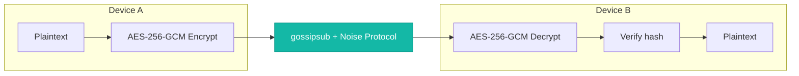
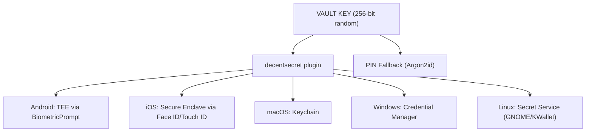

# Security

DecentPaste takes security seriously. This document describes the project security model, how it protects your data, and how to report vulnerabilities.

## Reporting Security Vulnerabilities

If you discover a security vulnerability, please report it responsibly:

1. **DO NOT** open a public GitHub issue for security vulnerabilities
2. Email security concerns to the maintainers via [GitHub private vulnerability reporting](https://github.com/decentpaste/decentpaste/security/advisories/new)
3. Include steps to reproduce and potential impact
4. Allow reasonable time for a fix before public disclosure

Project takes all reports seriously and will respond promptly.

---

## Security Architecture

### Cryptographic Stack

| Layer              | Technology      | Purpose                                                    |
|--------------------|-----------------|------------------------------------------------------------|
| **Key Exchange**   | X25519 ECDH     | Secure key derivation without transmitting secrets         |
| **Encryption**     | AES-256-GCM     | Authenticated encryption for clipboard and vault           |
| **Hashing**        | SHA-256         | Echo prevention and integrity verification                 |
| **Transport**      | libp2p Noise    | Encrypted peer-to-peer connections                         |
| **Key Derivation** | Argon2id        | PIN-to-key derivation (fallback when hardware unavailable) |
| **Secure Storage** | decentsecret    | Hardware-backed key storage (platform-native)              |

### Design Principles

- **Local-only by design**: Data never leaves your local network (mDNS discovery)
- **No cloud servers**: No central point of attack or data collection
- **Zero-knowledge pairing**: Shared secrets are derived, never transmitted
- **Per-peer encryption**: Each device pair has a unique encryption key

---

## Pairing Security (X25519 ECDH)

When two devices pair, they perform a Diffie-Hellman key exchange:

1. Devices exchange **public keys** (X25519)
2. Each device independently derives the **same shared secret** using ECDH
3. The shared secret is **never transmitted** — only public keys are exchanged
4. 6-digit PIN provides **visual verification** against MITM attacks
5. Each device pair has a **unique encryption key**

### Pairing Flow Diagram

```mermaid
sequenceDiagram
    participant A as Device A (Initiator)
    participant B as Device B (Responder)

    Note over A,B: Both devices on same local network (mDNS discovery)

    A->>B: PairingRequest {session_id, device_name, public_key_A}
    Note right of B: Store public_key_A
    Note right of B: Generate 6-digit PIN
    B->>A: PairingChallenge {session_id, PIN, device_name, public_key_B}
    Note left of A: Store public_key_B

    Note over A,B: Both devices display PIN for visual verification

    rect rgb(40, 40, 40)
        Note over A: User confirms PIN matches
        Note over A: Derive shared_secret = ECDH(private_A, public_B)
    end

    A->>B: PairingConfirm {session_id, success}

    rect rgb(40, 40, 40)
        Note over B: Derive shared_secret = ECDH(private_B, public_A)
        Note over B: Same secret! (math guarantees this)
    end

    B->>A: PairingConfirm (ack)

    Note over A,B: Paired! Both have identical shared_secret
    Note over A,B: Secret never transmitted - derived independently
```

### Why This Is Secure

- **ECDH math**: Both parties compute `shared = their_private × peer_public`, which yields identical results
- **PIN verification**: Prevents MITM attacks where an attacker could intercept and substitute public keys
- **No secret transmission**: Even if network traffic is captured, the shared secret cannot be derived without a private key

---

## Clipboard Sync Security

### Encryption Flow

### Per-Peer Encryption

Content is encrypted **separately for each paired peer** using their specific shared secret. This means:

- Peer A cannot decrypt messages intended for Peer B
- Compromising one pairing doesn't affect others
- Each relationship has cryptographic isolation

---

## Secure Vault Storage

All sensitive data is stored in an AES-256-GCM encrypted vault file (`vault.enc`). The encryption key is protected using platform-native hardware security when available, with PIN as a fallback.

### Platform Auth Methods

| Platform | Primary Method       | Key Storage               | Fallback |
|----------|----------------------|---------------------------|----------|
| Android  | Biometric prompt     | AndroidKeyStore (TEE)     | PIN      |
| iOS      | Face ID/Touch ID     | Secure Enclave            | PIN      |
| macOS    | Keychain + PIN (2FA) | Encrypted key in Keychain | PIN-only |
| Windows  | Credential Mgr + PIN | Encrypted key in CM       | PIN-only |
| Linux    | Secret Service + PIN | Encrypted key in SS       | PIN-only |

**Desktop 2FA (SecureStorageWithPin)**: On desktop platforms, the vault key is encrypted with a PIN-derived key (Argon2id) before being stored in the OS keychain. This provides 2-factor authentication:
- **What you have**: Physical access to a device with a keychain
- **What you know**: PIN to decrypt the keychain data

### What's Protected

| Data                          | Purpose                              |
|-------------------------------|--------------------------------------|
| Paired peers + shared secrets | Decrypt clipboard from each peer     |
| Clipboard history             | Optional persistence across sessions |
| Device identity + keypairs    | Consistent identity for pairing      |
| libp2p keypair                | Consistent PeerId across restarts    |

### Security Properties

- **Hardware-backed keys**: On mobile, keys are stored in TEE/Secure Enclave (never extractable)
- **Biometric binding**: Mobile keys are invalidated if biometric enrollment changes
- **Desktop 2FA**: Vault key encrypted with PIN-derived key, stored in OS keychain
- **Key never stored in plaintext**: Vault key is in hardware (mobile), encrypted in keychain (desktop), or derived from PIN
- **Per-device salt**: 16-byte random salt stored with an encrypted key (desktop) or in a separate file (PIN-only)
- **Auto-lock**: Vault locks after configurable inactivity timeout
- **Zeroize on drop**: Vault key is securely cleared from memory when locked

### PIN Fallback Mode

When hardware security is unavailable (e.g., Linux without Secret Service, devices without biometrics):

- User sets a 4-8 digit PIN during setup
- Vault key is derived via Argon2id (m=64MB, t=3, p=4)
- PIN is brute-forceable with physical access to `vault.enc` + `salt.bin`

**Important**: PIN mode only affects local storage. Peer-to-peer encryption always uses X25519 ECDH.

---

## Network Security

### Transport Encryption

All libp2p connections use the **Noise Protocol** for transport encryption, providing:

- Forward secrecy
- Mutual authentication
- Encrypted channels

### Local Network Scope

DecentPaste uses **mDNS** for device discovery, which:

- Only works on the local network segment
- Cannot be used for internet-wide attacks
- Limits exposure to devices on your WiFi/LAN

This is a deliberate security choice — your clipboard data never traverses the internet.

---

## Security Checklist for Users

- [ ] Use biometric/hardware security when available (preferred over PIN)
- [ ] If using PIN, choose 6+ digits
- [ ] Verify the 6-digit pairing PIN matches on both devices
- [ ] Only pair with devices you control
- [ ] Keep DecentPaste updated for security fixes
- [ ] Use on trusted networks (home/office WiFi)

---

## Changelog

| Date       | Change                                                                                                                |
|------------|-----------------------------------------------------------------------------------------------------------------------|
| 2026-01-11 | Added: Hardware-backed vault security (biometrics, TEE, Keychain) via `tauri-plugin-decentsecret`                     |
| 2026-01-01 | Fixed: Shared secret no longer transmitted during pairing ([#25](https://github.com/decentpaste/decentpaste/pull/25)) |

---

## Further Reading

- [ARCHITECTURE.md](ARCHITECTURE.md) — Technical implementation details
- [libp2p Security](https://docs.libp2p.io/concepts/secure-comm/) — Transport layer security
- [Argon2](https://en.wikipedia.org/wiki/Argon2) — Password hashing for PIN fallback
