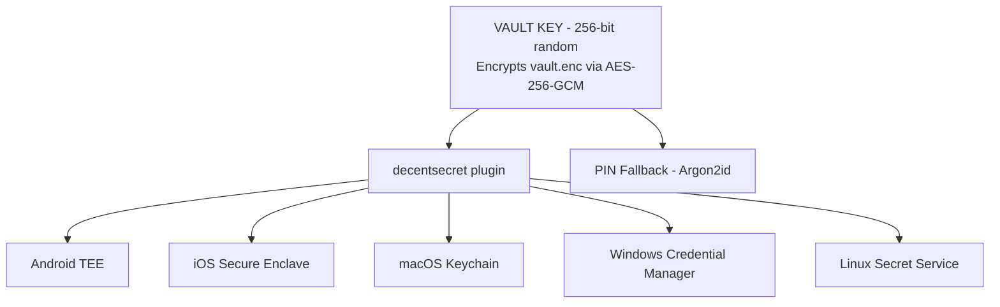
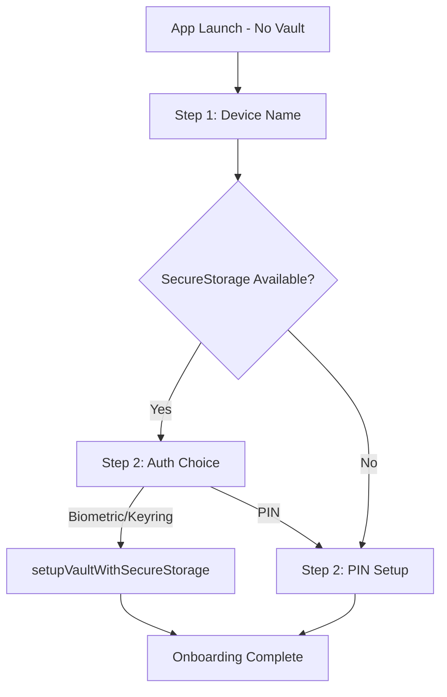
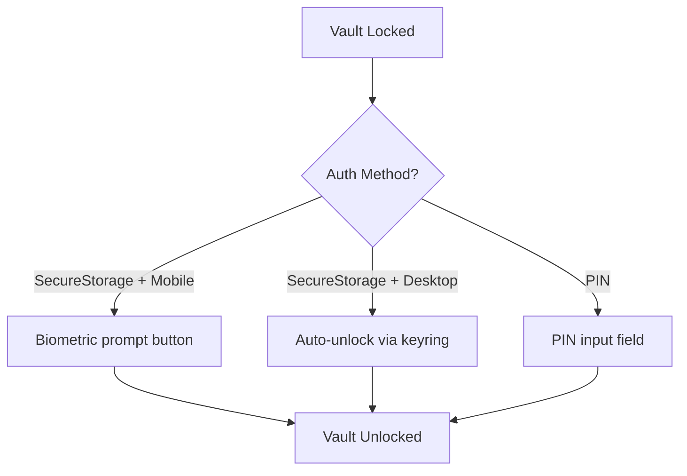

# Hardware Security Implementation Plan

## Current Status

| Phase       | Status         | Description                                                             |
|-------------|----------------|-------------------------------------------------------------------------|
| **Phase 0** | ✅ COMPLETE     | Removed Stronghold, added zeroize, created vault/storage.rs             |
| **Phase 1** | ✅ COMPLETE     | Created tauri-plugin-decentsecret with full Android/iOS/Desktop support |
| **Phase 2** | ✅ COMPLETE     | Wire plugin into VaultManager                                           |
| **Phase 3** | ✅ COMPLETE     | Frontend integration (onboarding UI, lock screen, auto-unlock)          |

### What's Been Implemented

**Phase 0 - Stronghold Removal:**
- Removed `tauri-plugin-stronghold` and `iota_stronghold` dependencies
- Added `zeroize = "1.7"` with derive feature for secure memory clearing
- Created `vault/storage.rs` with `VaultKey` (zeroize-on-drop) and `VaultData`
- Rewrote `vault/manager.rs` to use new AES-256-GCM encrypted file storage
- Vault file changed from `vault.hold` to `vault.enc`
- Updated `state.rs` flush helpers (changed `read()` → `write()` locks)

**Phase 1 - decentsecret Plugin:**
- Full plugin at `decentpaste-app/tauri-plugin-decentsecret/`
- **Rust layer**: `error.rs`, `models.rs`, `commands.rs`, `desktop.rs`, `mobile.rs`, `lib.rs`
- **Android**: `DecentsecretPlugin.kt` with BiometricPrompt + AndroidKeyStore (TEE)
- **iOS**: `DecentsecretPlugin.swift` with Secure Enclave + LocalAuthentication
- **Desktop**: Uses `keyring` crate (macOS Keychain, Windows Credential Manager, Linux Secret Service)
- **TypeScript**: Full API in `guest-js/index.ts`
- Plugin registered in app's `lib.rs` and `capabilities/default.json`
- **Build verified**: `cargo check` passes

**Phase 2 - VaultManager Integration:**
- **AuthMethod enum**: Updated to `SecureStorage | Pin` variants in `vault/auth.rs`
- **Auth persistence**: New `vault/auth_persistence.rs` stores chosen method in `auth-method.json`
- **VaultManager**: Added async methods in `vault/manager.rs`:
  - `create_with_secure_storage(app_handle)` - generates random 256-bit key, stores via plugin
  - `open_with_secure_storage(app_handle)` - retrieves key via plugin (triggers biometric)
  - `delete_secure_storage_key(app_handle)` - cleanup for vault reset
  - Renamed existing methods to `create_with_pin()` / `open_with_pin()`
- **New error variants**: `BiometricEnrollmentChanged`, `AuthenticationCancelled`, `SecureStorage(String)`
- **Tauri commands** in `commands.rs`:
  - `check_secret_storage_availability()` - returns platform capabilities
  - `get_vault_auth_method()` - returns stored auth method
  - `setup_vault_with_secure_storage(device_name)` - biometric/keyring setup
  - `setup_vault_with_pin(device_name, pin)` - PIN fallback setup
  - `unlock_vault(pin?)` - auto-detects method from `auth-method.json`
  - `reset_vault()` - updated to clean up secure storage key and auth method file
- **Removed**: Old `setup_vault(device_name, pin, auth_method)` command
- **Build verified**: `cargo check` passes

**Phase 3 - Frontend Integration:**
- **Types** (`src/api/types.ts`):
  - Added `SecretStorageMethod` union type (platform-specific methods)
  - Added `SecretStorageStatus` interface
  - Expanded `AuthMethod` to include `'secure_storage'`
- **Commands** (`src/api/commands.ts`):
  - Added `checkSecretStorageAvailability()` wrapper
  - Added `getVaultAuthMethod()` wrapper
- **State** (`src/state/store.ts`):
  - Added `secretStorageStatus` and `vaultAuthMethod` state fields
  - Expanded `OnboardingStep` to include `'auth-choice'`
- **Onboarding Flow** (`src/app.ts`):
  - New 3-step flow: Device Name → Auth Choice → PIN Setup (if chosen)
  - Auth choice shows platform-specific labels (Keychain, Biometric, etc.)
  - Skips auth choice step if SecureStorage unavailable
- **Lock Screen** (`src/app.ts`):
  - Shows "Unlock with [Method]" button for SecureStorage auth
  - Shows PIN input for PIN auth
  - Desktop auto-unlock for keyring-based auth (session-based, no prompt)

**Key Architecture Decision**: The vault key is either:
- **SecureStorage**: Random 256-bit key stored in hardware (biometric/keyring protected)
- **PIN**: Key derived from PIN via Argon2id (existing implementation)

---

## User Decisions (Confirmed)

| Decision      | Choice                                   | Implication                                       |
|---------------|------------------------------------------|---------------------------------------------------|
| Migration     | Force re-setup                           | No migration code; users factory reset on upgrade |
| Mobile auth   | Biometric-only where available           | No PIN recovery; biometric change = vault lost    |
| Desktop auth  | Keyring-only where available             | PIN only if keyring unavailable                   |
| Plugin design | Unified `decentsecret` for ALL platforms | Single API, open-source friendly                  |

---

## Architecture Overview

### Unified Security Model



### Platform Auth Matrix

| Platform | decentsecret Available | Auth Method | Key Storage           |
|----------|------------------------|-------------|-----------------------|
| Android  | Has biometrics         | Biometric   | AndroidKeyStore (TEE) |
| Android  | No biometrics          | Unavailable | PIN fallback          |
| iOS      | Has biometrics         | Biometric   | Secure Enclave        |
| iOS      | No biometrics          | Unavailable | PIN fallback          |
| macOS    | Always                 | Keyring     | macOS Keychain        |
| Windows  | Always                 | Keyring     | Credential Manager    |
| Linux    | Has Secret Service     | Keyring     | GNOME Keyring/KWallet |
| Linux    | No Secret Service      | Unavailable | PIN fallback          |

**Key insight**: App code only needs to:
1. Check if `decentsecret` is available
2. If yes, use plugin
3. If no, fall back to PIN

---

## `tauri-plugin-decentsecret` Design (IMPLEMENTED)

### Plugin Philosophy

This plugin provides **unified secure credential storage** across all platforms:
- **Mobile**: Hardware-backed biometric authentication (TEE/Secure Enclave)
- **Desktop**: OS-provided credential storage (Keychain/Credential Manager/Secret Service)

The plugin abstracts away platform differences. Consumers see ONE API.

### Rust API (Public Interface)

```rust
// tauri-plugin-decentsecret/src/lib.rs

use serde::{Deserialize, Serialize};

/// Check what secure storage capabilities are available on this platform
#[tauri::command]
pub async fn check_availability() -> SecretStorageStatus;

/// Store a secret (vault key) in platform secure storage
/// - Android: Wraps with biometric-protected key in AndroidKeyStore
/// - iOS: Stores in Keychain with Secure Enclave protection
/// - Desktop: Stores in OS keyring
#[tauri::command]
pub async fn store_secret(secret: Vec<u8>) -> Result<(), SecretStorageError>;

/// Retrieve secret from platform secure storage
/// - Android: Shows BiometricPrompt, unwraps with TEE
/// - iOS: Shows Face ID/Touch ID, retrieves from Secure Enclave
/// - Desktop: Retrieves from OS keyring (no prompt, session-based)
#[tauri::command]
pub async fn retrieve_secret() -> Result<Vec<u8>, SecretStorageError>;

/// Delete secret from platform secure storage
#[tauri::command]
pub async fn delete_secret() -> Result<(), SecretStorageError>;

// Types

#[derive(Debug, Clone, Serialize, Deserialize)]
pub struct SecretStorageStatus {
    pub available: bool,
    pub method: Option<SecretStorageMethod>,
    pub unavailable_reason: Option<String>,
}

#[derive(Debug, Clone, Serialize, Deserialize)]
pub enum SecretStorageMethod {
    AndroidBiometric,
    IOSBiometric,
    MacOSKeychain,
    WindowsCredentialManager,
    LinuxSecretService,
}

#[derive(Debug, Clone, Serialize, Deserialize)]
pub enum SecretStorageError {
    NotAvailable,
    AuthenticationFailed,
    BiometricEnrollmentChanged,
    NoBiometricsEnrolled,
    SecretNotFound,
    AccessDenied,
    InternalError(String),
}
```

### TypeScript API

```typescript
export interface SecretStorageStatus {
  available: boolean;
  method: SecretStorageMethod | null;
  unavailable_reason: string | null;
}

export type SecretStorageMethod =
  | 'AndroidBiometric'
  | 'IOSBiometric'
  | 'MacOSKeychain'
  | 'WindowsCredentialManager'
  | 'LinuxSecretService';

export type SecretStorageError =
  | 'NotAvailable'
  | 'AuthenticationFailed'
  | 'BiometricEnrollmentChanged'
  | 'NoBiometricsEnrolled'
  | 'SecretNotFound'
  | 'AccessDenied'
  | { InternalError: string };

export async function checkAvailability(): Promise<SecretStorageStatus>;
export async function storeSecret(secret: number[]): Promise<void>;
export async function retrieveSecret(): Promise<number[]>;
export async function deleteSecret(): Promise<void>;
```

---

## Platform Implementations (IMPLEMENTED)

### Android: `DecentsecretPlugin.kt`

**Critical security flags:**
```kotlin
KeyGenParameterSpec.Builder(KEY_ALIAS, PURPOSE_ENCRYPT or PURPOSE_DECRYPT)
    .setBlockModes(KeyProperties.BLOCK_MODE_GCM)
    .setEncryptionPaddings(KeyProperties.ENCRYPTION_PADDING_NONE)
    .setKeySize(256)
    .setUserAuthenticationRequired(true)
    .setInvalidatedByBiometricEnrollment(true)  // CRITICAL
    .setUserAuthenticationParameters(0, KeyProperties.AUTH_BIOMETRIC_STRONG)
```

**Thread safety:** Uses `ConcurrentHashMap` for pending biometric operations.

### iOS: `DecentsecretPlugin.swift`

**Critical security flags:**
```swift
let accessControl = SecAccessControlCreateWithFlags(
    nil,
    kSecAttrAccessibleWhenPasscodeSetThisDeviceOnly,
    [.biometryCurrentSet],  // CRITICAL: invalidate on biometric change
    nil
)
```

### Desktop: `desktop.rs`

Uses `keyring` crate for cross-platform OS keychain access:
- macOS: Keychain Access
- Windows: Credential Manager
- Linux: Secret Service API (GNOME Keyring, KWallet)

---

## Implementation Phases

### Phase 0: Remove Stronghold + Add Zeroize ✅ COMPLETE

**Goal**: Replace Stronghold with simple AES-256-GCM encrypted file.

**Why remove Stronghold:**
- Work factor disabled (0) = no security benefit
- 20+ transitive dependencies for JSON encryption
- Existing AES-256-GCM + Argon2id provides identical security

**Completed:**
- ✅ Added `zeroize = "1.7"` with `derive` feature
- ✅ Removed `tauri-plugin-stronghold` and `iota_stronghold`
- ✅ Created `vault/storage.rs` with `VaultKey` and `VaultData`
- ✅ Updated `VaultManager` to use new storage
- ✅ Removed Stronghold plugin init from `lib.rs`
- ✅ Removed `stronghold:default` from capabilities

**Files Modified:**
- `src-tauri/Cargo.toml`
- `src-tauri/src/lib.rs`
- `src-tauri/src/vault/storage.rs` (NEW)
- `src-tauri/src/vault/manager.rs`
- `src-tauri/src/vault/mod.rs`
- `src-tauri/src/vault/error.rs`
- `src-tauri/src/state.rs`
- `src-tauri/capabilities/default.json`

### Phase 1: Create `tauri-plugin-decentsecret` ✅ COMPLETE

**Goal**: Unified plugin for ALL platforms.

**Completed:**
- ✅ Created plugin directory structure
- ✅ Implemented Rust wrapper (error.rs, models.rs, commands.rs)
- ✅ Implemented desktop.rs with keyring crate
- ✅ Implemented mobile.rs bridge
- ✅ Implemented Android native code (DecentsecretPlugin.kt)
- ✅ Implemented iOS native code (DecentsecretPlugin.swift)
- ✅ Updated TypeScript bindings (guest-js/index.ts)
- ✅ Added plugin to app's Cargo.toml
- ✅ Registered plugin in `lib.rs`
- ✅ Added `decentsecret:default` to capabilities
- ✅ Build verified with `cargo check`

**Plugin Structure:**
```
tauri-plugin-decentsecret/
├── Cargo.toml
├── build.rs
├── src/
│   ├── lib.rs
│   ├── commands.rs
│   ├── error.rs
│   ├── models.rs
│   ├── mobile.rs
│   └── desktop.rs
├── android/
│   ├── build.gradle.kts (added biometric dependency)
│   └── src/main/java/.../DecentsecretPlugin.kt
├── ios/
│   └── Sources/DecentsecretPlugin.swift
├── guest-js/
│   └── index.ts
└── permissions/
    └── default.toml
```

### Phase 2: VaultManager Integration ✅ COMPLETE

**Goal**: Wire plugin into vault system.

**Completed:**
- ✅ AuthMethod enum with `SecureStorage | Pin` variants
- ✅ Auth persistence in `auth-method.json`
- ✅ VaultManager async methods for secure storage
- ✅ New Tauri commands for auth flow
- ✅ Build verified

### Phase 3: Frontend Integration ✅ COMPLETE

**Goal**: Update UI for new auth flow.

**Completed:**
- ✅ TypeScript types and command wrappers
- ✅ State management updates
- ✅ 3-step onboarding flow with auth choice
- ✅ Lock screen with biometric/keyring support
- ✅ Desktop auto-unlock
- ✅ Android JSON serialization bug fix

**Onboarding flow:**



**Lock screen flow:**



---

## Files Summary

### Phase 0: Stronghold Removal ✅
| File                             | Action                              | Status |
|----------------------------------|-------------------------------------|--------|
| `src-tauri/Cargo.toml`           | Remove stronghold deps, add zeroize | ✅      |
| `src-tauri/src/lib.rs`           | Remove stronghold init              | ✅      |
| `src-tauri/src/vault/storage.rs` | Create - VaultKey, VaultData        | ✅      |
| `src-tauri/src/vault/manager.rs` | Modify - use new storage            | ✅      |
| `src-tauri/src/vault/error.rs`   | Rename Stronghold → Encryption      | ✅      |
| `src-tauri/src/state.rs`         | Change read() → write() locks       | ✅      |

### Phase 1: Plugin Creation ✅
| File                                        | Action              | Status |
|---------------------------------------------|---------------------|--------|
| `tauri-plugin-decentsecret/src/error.rs`    | Error types         | ✅      |
| `tauri-plugin-decentsecret/src/models.rs`   | Data types          | ✅      |
| `tauri-plugin-decentsecret/src/commands.rs` | Tauri commands      | ✅      |
| `tauri-plugin-decentsecret/src/desktop.rs`  | Keyring integration | ✅      |
| `tauri-plugin-decentsecret/src/mobile.rs`   | Mobile bridge       | ✅      |
| `tauri-plugin-decentsecret/src/lib.rs`      | Plugin init         | ✅      |
| `tauri-plugin-decentsecret/android/...`     | BiometricPrompt     | ✅      |
| `tauri-plugin-decentsecret/ios/...`         | Secure Enclave      | ✅      |
| `tauri-plugin-decentsecret/guest-js/...`    | TypeScript API      | ✅      |

### Phase 2: Integration ✅
| File                                       | Action                         | Status |
|--------------------------------------------|--------------------------------|--------|
| `src-tauri/src/vault/auth.rs`              | Add SecureStorage variant      | ✅      |
| `src-tauri/src/vault/auth_persistence.rs`  | Auth method file storage (NEW) | ✅      |
| `src-tauri/src/vault/mod.rs`               | Export new module              | ✅      |
| `src-tauri/src/vault/manager.rs`           | Add secure storage methods     | ✅      |
| `src-tauri/src/error.rs`                   | Add new error variants         | ✅      |
| `src-tauri/src/commands.rs`                | New auth commands              | ✅      |
| `src-tauri/src/lib.rs`                     | Register new commands          | ✅      |

### Phase 3: Frontend ✅
| File                  | Action                                    | Status |
|-----------------------|-------------------------------------------|--------|
| `src/api/types.ts`    | Add SecretStorageStatus, expand AuthMethod | ✅     |
| `src/api/commands.ts` | Add availability + auth method commands    | ✅     |
| `src/state/store.ts`  | Add new state fields, expand OnboardingStep | ✅    |
| `src/app.ts`          | Auth choice step, lock screen variants     | ✅     |
| `DecentsecretPlugin.kt` | Fix JSON array serialization            | ✅     |

---

## Verification Plan

### Desktop Keyring Flow
1. Fresh install → `checkSecretStorageAvailability()` returns available
2. Onboarding → `setupVaultWithSecureStorage()` → key stored in keyring
3. Onboarding → `setDeviceName(name)` → device name saved
4. App restart → auto-unlocks via keyring

### Desktop PIN Flow (Linux without Secret Service)
1. Fresh install → `checkSecretStorageAvailability()` returns unavailable
2. Onboarding → `setupVaultWithPin(pin)` → vault created with Argon2id
3. App restart → shows PIN prompt

### Mobile Biometric Flow
1. Fresh install → `checkSecretStorageAvailability()` returns available
2. Onboarding → `setupVaultWithSecureStorage()` → biometric prompt → key in TEE/SE
3. App restart → biometric prompt
4. Biometric change → key invalidated → **vault lost** (expected)

### Mobile PIN Flow (no biometrics)
1. Fresh install → `checkSecretStorageAvailability()` returns unavailable
2. Onboarding → `setupVaultWithPin(pin)` → vault created with Argon2id
3. App restart → shows PIN prompt

---

## Risk Acknowledgment

**Accepted Risk**: Mobile biometric-only means biometric enrollment change = vault data loss.

**Mitigation**: Clear warning during setup.

**Desktop Security Note**: Keyring provides convenience (session-based auto-unlock), not per-operation security.
