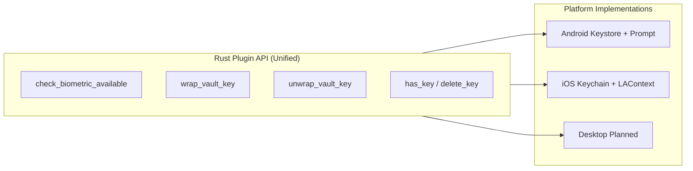
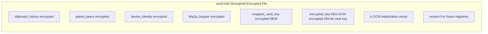
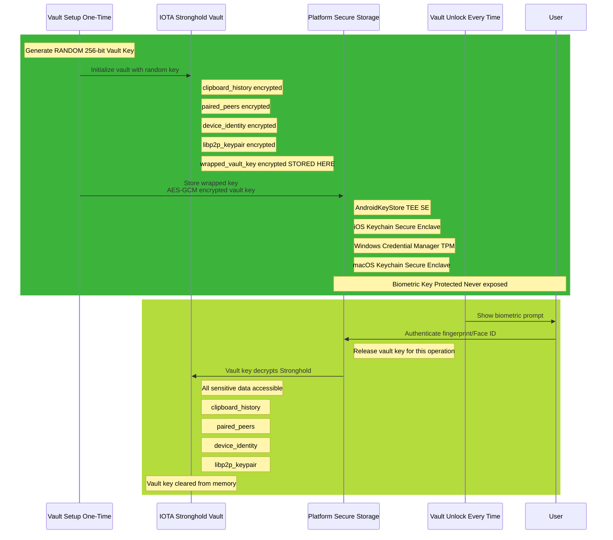
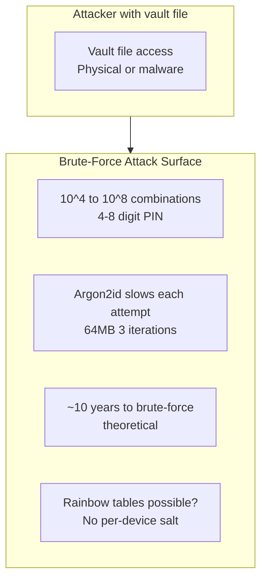
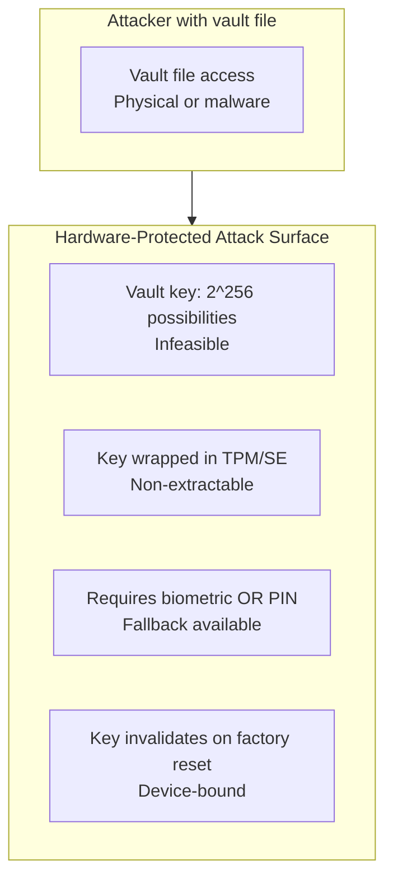

# Biometric Authentication Implementation Plan

**Status**: Planned
**Priority**: High
**Target**: Android-first, iOS follows same pattern, desktop future

## Overview

This plan describes the implementation of biometric authentication for DecentPaste's vault system, replacing PIN-based authentication with hardware-backed biometric protection.

### Problem Statement

The current PIN-based vault authentication has security limitations:
- PIN is brute-forceable (though Argon2id slows it significantly)
- PIN must be derived each time (memory-intensive)
- No hardware protection (relies on KDF strength)

### Solution

Implement biometric authentication using platform-native secure storage:
- **Android**: AndroidKeyStore + BiometricPrompt
- **iOS**: Keychain + LocalAuthentication
- **Windows/macOS/Linux**: Future (Windows Hello, Touch ID, TPM/FIDO2)

The vault encryption key is randomly generated (not derived from user input) and wrapped with a biometric-protected key stored in hardware secure storage.

## Concerns Analysis & Solutions

### 1. Vault Key Generation & Storage

**Concern**: How do we generate a random vault key and ensure it's never exposed?

**Solution**:
```rust
// Generate random 256-bit vault key during setup
let vault_key: [u8; 32] = rand::random();

// Create Stronghold vault with random key
let stronghold = Stronghold::new(&vault_path, vault_key.to_vec())?;

// Wrap vault key with biometrics (requires user authentication)
let wrapped = bioauth.wrap_vault_key(&vault_key)?;

// Store wrapped key in encrypted vault (never in plaintext)
manager.set_wrapped_vault_key(&wrapped)?;
manager.flush()?;

// Explicitly clear vault key from memory
drop(vault_key);
```

**Security properties**:
- Vault key only in memory during: creation, unlock
- Never stored to disk in plaintext
- Cleared immediately after Stronghold initialization
- Biometric-protected key never leaves hardware

### 2. Android BiometricPrompt Asynchronous Flow

**Concern**: `BiometricPrompt` uses callbacks, but Tauri expects synchronous command responses.

**Solution**: Use `CryptoObject` pattern with callback management:

```kotlin
// Kotlin implementation pattern
private var pendingInvoke: Invoke? = null
private lateinit var biometricPrompt: BiometricPrompt

override fun load(webView: WebView) {
    biometricPrompt = BiometricPrompt(activity, executor,
        object : BiometricPrompt.AuthenticationCallback() {
            override fun onAuthenticationSucceeded(result: BiometricPrompt.AuthenticationResult) {
                // CryptoObject released - perform cipher operation NOW
                handleCipherOperation(result.cryptoObject)
            }
            override fun onAuthenticationFailed() {
                resolveWithError(success = false, cancelled = false)
            }
            override fun onAuthenticationError(errorCode: Int, errString: CharSequence) {
                if (errorCode == BiometricPrompt.ERROR_USER_CANCELED) {
                    resolveWithError(success = false, cancelled = true)
                } else {
                    resolveWithError(success = false, cancelled = false)
                }
            }
        })
}

@Command
fun unwrapVaultKey(invoke: Invoke, encryptedKey: String, iv: String) {
    pendingInvoke = invoke
    currentCipher = initDecryptionCipher(encryptedKey, iv)

    // Show prompt - callback handles the rest
    biometricPrompt.authenticate(promptInfo, BiometricPrompt.CryptoObject(currentCipher))
}
```

**Key insight**: The command doesn't return synchronously. It:
1. Sets up pending invoke reference
2. Shows biometric prompt
3. Callback (running on main thread) resolves the invoke later
4. Cipher operation happens immediately after successful auth

### 3. Platform API Differences

**Concern**: Different platforms have vastly different biometric APIs.

**Solution**: Unified plugin API with platform-specific implementations:



**Contract**: All platform implementations must:
- Accept same input types
- Return same output types
- Handle user cancellation gracefully
- Report biometric availability with reason string

### 4. Single Vault vs Separate Vaults

**Concern**: Should we create separate vault files for PIN vs biometric, or share one?

**Decision**: **Single vault with wrapped key storage**

**Rationale**:
- Simplifies migration (no file copying)
- Backward compatible with existing PIN vaults
- Single source of truth for encrypted data
- Wrapped biometric key stored inside vault (itself encrypted)

**Architecture**:


### 5. Vault Key Extraction for Migration

**Concern**: Stronghold doesn't expose the encryption key, so how do we migrate PIN vaults to biometric?

**Solution**: Two-phase migration approach:

**Phase 1: Initial implementation (simpler)**
- User must reset vault and set up new biometric vault
- Data loss is acceptable for alpha-stage feature

**Phase 2: Smooth migration (future)**
Implement "vault re-keying" operation:
```rust
async fn migrate_pin_to_biometric() -> Result<()> {
    // 1. Unlock with PIN (current method)
    let mut pin_manager = VaultManager::new();
    pin_manager.open(&pin)?;

    // 2. Extract all data from PIN-protected vault
    let peers = pin_manager.get_paired_peers()?;
    let identity = pin_manager.get_device_identity()?;
    let keypair = pin_manager.get_libp2p_keypair()?;
    let history = pin_manager.get_clipboard_history()?;

    // 3. Lock PIN vault
    pin_manager.lock();

    // 4. Create new biometric vault with random key
    let mut bio_manager = VaultManager::new();
    let vault_key = bio_manager.create_biometric()?;

    // 5. Wrap vault key with biometrics
    let wrapped = bioauth.wrap_vault_key(&vault_key)?;
    bio_manager.set_wrapped_vault_key(&wrapped)?;

    // 6. Copy all data to new vault
    bio_manager.set_paired_peers(&peers)?;
    bio_manager.set_device_identity(&identity)?;
    bio_manager.set_libp2p_keypair(&keypair)?;
    bio_manager.set_clipboard_history(&history)?;

    // 7. Replace old vault file
    std::fs::remove_file("vault.hold")?;
    bio_manager.flush()?;

    // 8. Update settings
    settings.auth_method = Some("biometric".to_string());
}
```

### 6. Biometric Key Deletion Handling

**Concern**: What happens when user removes biometrics (unenrolls fingerprint, factory reset)?

**Solution**: Graceful degradation with detection:

```typescript
// Frontend flow
async function unlockVault() {
  try {
    const unwrapped = await bioauth.unwrapVaultKey(wrappedKey);
    if (unwrapped.cancelled) {
      // User cancelled - do nothing
      return;
    }
    if (!unwrapped.success) {
      // Biometric failed - check if key exists
      const hasKey = await bioauth.hasBiometricKey();
      if (!hasKey) {
        // Key was invalidated - offer recovery options
        showRecoveryDialog({
          options: [
            "Re-enroll biometrics (requires PIN)",
            "Use PIN fallback (if enabled)",
            "Reset vault (last resort)"
          ]
        });
      }
      return;
    }

    // Success - proceed with unlock
    await unlockVaultWithKey(unwrapped.vaultKey);
  } catch (error) {
    showError(error.message);
  }
}
```

## Implementation Phases

### Phase 1: Plugin Initialization

**Goal**: Create `tauri-plugin-decentsecret` plugin structure

**Tasks**:
1. Create plugin with Android support
   ```bash
   cd decentpaste-app
   npx @tauri-apps/cli plugin new decentsecret --android --no-api
   ```

2. Set up plugin structure:
   - `src/lib.rs` - Plugin entry point
   - `src/mobile.rs` - Mobile implementation
   - `src/desktop.rs` - Desktop stub (returns "not supported")
   - `src/commands.rs` - Tauri commands
   - `src/models.rs` - Shared types
   - `src/error.rs` - Plugin error types
   - `android/src/main/java/com/decentpaste/plugins/decentsecret/DecentsecretPlugin.kt`
   - `android/src/main/AndroidManifest.xml`
   - `permissions/default.toml` - Command permissions
   - `README.md` - Plugin documentation

3. Define core types (`src/models.rs`):
   ```rust
   pub struct BiometricAvailability { available: bool, reason: String, hardware_type: Option<String> }
   pub struct WrappedVaultKey { encrypted_key: String, iv: String, version: u8 }
   pub struct WrapKeyResponse { wrapped_key: WrappedVaultKey, success: bool }
   pub struct UnwrapKeyResponse { vault_key: Option<String>, success: bool, cancelled: bool }
   ```

4. Define plugin commands (`src/commands.rs`):
   - `check_biometric_available` - Check if biometrics available
   - `wrap_vault_key` - Wrap vault key with biometrics
   - `unwrap_vault_key` - Unwrap vault key with biometrics
   - `has_biometric_key` - Check if biometric key exists
   - `delete_biometric_key` - Delete biometric key

**Deliverable**: Plugin compiles, can be added to app

### Phase 2: Android Implementation

**Goal**: Full biometric authentication on Android

**Tasks**:
1. Implement `DecentsecretPlugin.kt`:
   - `checkBiometricAvailable()` - Use `BiometricManager.canAuthenticate()`
   - `wrapVaultKey()` - Generate/create biometric key, encrypt vault key
   - `unwrapVaultKey()` - Decrypt vault key with biometric prompt
   - `hasKey()` / `deleteKey()` - KeyStore operations
   - BiometricPrompt setup with callback management
   - CryptoObject pattern for encryption/decryption

2. Android manifest permissions:
   ```xml
   <uses-permission android:name="android.permission.USE_BIOMETRIC" />
   ```

3. Kotlin-specific implementation details:
   - `KEY_ALIAS = "decentsecret_vault_key"`
   - `ENCRYPTION_ALGORITHM = "AES/GCM/NoPadding"`
   - `setUserAuthenticationRequired(true)`
   - `setUserAuthenticationValidityDurationSeconds(0)` - Auth every time
   - `setInvalidatedByBiometricEnrollment(false)` - Survive biometric changes

**Deliverable**: Android biometric auth works on emulator and physical device

### Phase 3: iOS Implementation

**Goal**: Full biometric authentication on iOS

**Tasks**:
1. Implement `DecentsecretPlugin.swift`:
   - `checkBiometricAvailable()` - Use `LAContext.canEvaluatePolicy()`
   - `wrapVaultKey()` - Generate/create SecKey, encrypt vault key
   - `unwrapVaultKey()` - Decrypt vault key with LAContext prompt
   - `hasKey()` / `deleteKey()` - Keychain queries
   - Use `SecAccessControl` for biometric binding

2. Swift-specific implementation details:
   - `KEY_ALIAS = "decentsecret_vault_key"`
   - `ENCRYPTION_ALGORITHM = SecKeyAlgorithm.eciesEncryptionCofactorVariableIVX963SHA256AESGCM`
   - `kSecAttrAccessControl` with `.userPresence`
   - `kSecAttrAccessibleWhenPasscodeSetThisDeviceOnly` - Survive biometric changes

3. No iOS permissions required (LocalAuthentication works out of box)

**Deliverable**: iOS biometric auth works on simulator and physical device

### Phase 4: VaultManager Integration

**Goal**: Integrate biometric authentication with existing vault system

**Tasks**:
1. Update `vault/auth.rs`:
   ```rust
   pub enum AuthMethod {
       Pin,       // Existing
       Biometric,  // NEW
   }
   ```

2. Add new VaultManager methods (`vault/manager.rs`):
   ```rust
   pub fn generate_random_vault_key() -> [u8; 32];
   pub fn create_biometric(&mut self) -> Result<Vec<u8>>;  // Returns vault key for wrapping
   pub fn open_with_key(&mut self, vault_key: &[u8; 32]) -> Result<()>;
   pub fn set_wrapped_vault_key(&self, wrapped: &WrappedVaultKey) -> Result<()>;
   pub fn get_wrapped_vault_key(&self) -> Result<Option<WrappedVaultKey>>;
   ```

3. Add new Stronghold store constant:
   ```rust
   const STORE_KEY_WRAPPED_VAULT_KEY: &[u8] = b"wrapped_vault_key";
   ```

**Deliverable**: VaultManager supports both PIN and biometric methods

### Phase 5: App Commands Integration

**Goal**: Add Tauri commands for biometric vault operations

**Tasks**:
1. Add commands to `commands.rs`:
   ```rust
   #[tauri::command]
   pub async fn setup_vault_biometric<R: Runtime>(
       app_handle: AppHandle,
       state: State<'_, AppState>,
       bioauth: State<'_, Decentsecret<R>>,
       device_name: String,
   ) -> Result<()>;

   #[tauri::command]
   pub async fn unlock_vault_biometric<R: Runtime>(
       app_handle: AppHandle,
       state: State<'_, AppState>,
       bioauth: State<'_, Decentsecret<R>>,
   ) -> Result<()>;

   #[tauri::command]
   pub async fn migrate_to_biometric<R: Runtime>(
       state: State<'_, AppState>,
       bioauth: State<'_, Decentsecret<R>>,
   ) -> Result<()>;
   ```

2. Update `lib.rs` to register plugin:
   ```rust
   #[cfg(mobile)]
   use tauri_plugin_decentsecret::DecentsecretExt;

   // In setup():
   #[cfg(mobile)]
   .plugin(tauri_plugin_decentsecret::init())
   ```

3. Update `Cargo.toml`:
   ```toml
   [dependencies]
   tauri-plugin-decentsecret = { path = "../tauri-plugin-decentsecret" }
   ```

**Deliverable**: App can create, unlock, and migrate biometric vaults

### Phase 6: Frontend Integration

**Goal**: UI to use biometric authentication

**Tasks**:
1. Add TypeScript API (`src/api/`):
   ```typescript
   interface BiometricAvailability {
     available: boolean;
     reason: string;
     hardwareType?: 'fingerprint' | 'face' | null;
   }

   export async function checkBiometricAvailable(): Promise<BiometricAvailability>;
   export async function wrapVaultKey(vaultKey: string): Promise<WrappedVaultKey>;
   export async function unwrapVaultKey(wrapped: WrappedVaultKey): Promise<UnwrapKeyResponse>;
   export async function hasBiometricKey(): Promise<boolean>;
   export async function deleteBiometricKey(): Promise<void>;

   // High-level helpers
   export async function setupVaultBiometric(deviceName: string): Promise<void>;
   export async function unlockVaultBiometric(): Promise<void>;
   export async function migrateToBiometric(): Promise<void>;
   ```

2. Update `app.ts` auth flow:
   - Onboarding: Check biometric availability, offer option vs PIN
   - Lock screen: Show "Use fingerprint/Face ID" button if `auth_method == "biometric"`
   - Migration: Show "Enable biometrics" option in Settings if `auth_method == "pin"`

**Deliverable**: UI supports biometric auth throughout app

### Phase 7: Testing

**Goal**: Validate implementation on all platforms

**Tasks**:
1. **Android testing**:
   - [ ] Create biometric vault (emulator with mock biometrics)
   - [ ] Unlock with fingerprint (physical device)
   - [ ] Cancel biometric prompt
   - [ ] Fail biometric (wrong finger)
   - [ ] Remove fingerprint and re-enroll
   - [ ] Reset vault

2. **iOS testing**:
   - [ ] Create biometric vault (simulator)
   - [ ] Unlock with Face ID (physical device with Face ID)
   - [ ] Unlock with Touch ID (physical device with Touch ID)
   - [ ] Cancel biometric prompt
   - [ ] Remove Face ID/Touch ID and re-enroll
   - [ ] Reset vault

3. **Integration testing**:
   - [ ] Pair devices with biometric vault
   - [ ] Share clipboard with biometric vault
   - [ ] Receive clipboard with biometric vault
   - [ ] Migrate PIN vault to biometric
   - [ ] Background/foreground behavior (mobile)

**Deliverable**: All test cases pass

### Phase 8: Documentation

**Goal**: Comprehensive documentation for users and developers

**Tasks**:
1. **Plugin README.md** (`tauri-plugin-decentsecret/README.md`):
   - Plugin purpose and security architecture
   - API reference with examples
   - Platform support matrix
   - Integration guide

2. **Update ARCHITECTURE.md**:
   - Add biometric authentication section
   - Update vault system diagram
   - Update command list
   - Update `AuthMethod` enum

3. **Update SECURITY.md**:
   - Add biometric security model section
   - Compare PIN vs biometric security
   - Update threat model
   - Add recovery guidance

4. **Update README.md** (project root):
   - Update tech stack table
   - Update feature list
   - Mention biometric authentication

**Deliverable**: All documentation up-to-date

## Security Architecture

### Data Flow Diagram



### Security Properties

| Property | PIN-Based | Biometric-Based |
|----------|-------------|-----------------|
| **Key Derivation** | Argon2id from PIN | Random 256-bit |
| **Key Storage** | Not stored, derived each time | Wrapped in hardware TPM/SE |
| **Brute-force Resistance** | Argon2id (64MB, 3 iter) | Hardware TPM (infeasible) |
| **Physical Theft** | Requires PIN knowledge | Requires biometrics OR PIN fallback |
| **Malware (Root/Admin)** | Can steal PIN from keystrokes | Cannot extract key from hardware |
| **Network Intercept** | Key never transmitted | Key never transmitted |
| **Key Exposure Time** | Brief (derivation) | Brief (unlock) |
| **Recovery** | Always works (if PIN known) | Re-enroll or PIN fallback |
| **Key Invalidation** | None (until vault reset) | Biometric removal invalidates (recoverable) |

### Attack Surface Reduction

**Before (PIN-based)**:


**After (Biometric-based)**:


## Implementation Checklist

### Phase 1: Plugin Initialization
- [ ] Create `tauri-plugin-decentsecret` structure
- [ ] Define Rust plugin API
- [ ] Define shared types (models.rs)
- [ ] Define Tauri commands (commands.rs)
- [ ] Create `build.rs` for permission generation
- [ ] Create `permissions/default.toml`

### Phase 2: Android Implementation
- [ ] Implement `DecentsecretPlugin.kt`
  - [ ] BiometricManager setup
  - [ ] BiometricPrompt with callback management
  - [ ] AndroidKeyStore key generation
  - [ ] AES-GCM encryption/decryption
  - [ ] All commands implemented
- [ ] Add `USE_BIOMETRIC` permission to AndroidManifest.xml
- [ ] Test on Android emulator (with mock biometrics)
- [ ] Test on physical Android device

### Phase 3: iOS Implementation
- [ ] Create iOS plugin structure
- [ ] Implement `DecentsecretPlugin.swift`
  - [ ] LAContext setup
  - [ ] SecAccessControl for biometric binding
  - [ ] Keychain key generation
  - [ ] AES-GCM encryption/decryption
  - [ ] All commands implemented
- [ ] Test on iOS simulator
- [ ] Test on physical iOS device (Face ID and/or Touch ID)

### Phase 4: VaultManager Integration
- [ ] Add `Biometric` to `AuthMethod` enum
- [ ] Implement `generate_random_vault_key()`
- [ ] Implement `create_biometric()`
- [ ] Implement `open_with_key()`
- [ ] Implement `set_wrapped_vault_key()`
- [ ] Implement `get_wrapped_vault_key()`
- [ ] Add `STORE_KEY_WRAPPED_VAULT_KEY` constant

### Phase 5: App Commands Integration
- [ ] Add `setup_vault_biometric` command
- [ ] Add `unlock_vault_biometric` command
- [ ] Add `migrate_to_biometric` command
- [ ] Register plugin in `lib.rs`
- [ ] Add plugin to `Cargo.toml`

### Phase 6: Frontend Integration
- [ ] Add TypeScript API functions
- [ ] Update onboarding flow to offer biometric option
- [ ] Update lock screen to show biometric button
- [ ] Add biometric enable/migration UI in Settings
- [ ] Handle biometric errors and cancellation gracefully
- [ ] Add recovery dialog for lost biometrics

### Phase 7: Testing
- [ ] Android: Create biometric vault
- [ ] Android: Unlock with biometrics
- [ ] Android: Cancel prompt
- [ ] Android: Remove biometrics
- [ ] iOS: Create biometric vault
- [ ] iOS: Unlock with biometrics
- [ ] iOS: Cancel prompt
- [ ] iOS: Remove biometrics
- [ ] Integration: Pair with biometric vault
- [ ] Integration: Share clipboard with biometric vault
- [ ] Integration: Migrate PIN to biometric

### Phase 8: Documentation
- [ ] Write `tauri-plugin-decentsecret/README.md`
- [ ] Update `ARCHITECTURE.md` with biometric section
- [ ] Update `SECURITY.md` with biometric security model
- [ ] Update project `README.md`
- [ ] Update `AGENTS.md` with biometric plugin guidance

## Dependencies

### New Dependencies (Plugin)

**Rust** (`tauri-plugin-decentsecret/Cargo.toml`):
```toml
[dependencies]
tauri = { version = "2" }
serde = { version = "1", features = ["derive"] }
serde_json = "1"
thiserror = "2"
base64 = "0.22"
hex = "0.4"

[target.'cfg(target_os = "android")'.dependencies]
jni = "0.21"

[build-dependencies]
tauri-plugin = { version = "2", features = ["build"] }
schemars = "0.8"
```

**App** (`decentpaste-app/src-tauri/Cargo.toml`):
```toml
[dependencies]
tauri-plugin-decentsecret = { path = "../tauri-plugin-decentsecret" }
```

### Native Dependencies

**Android**:
- `androidx.biometric:biometric` - BiometricPrompt
- `javax.crypto:*` - AES-GCM encryption
- `android.security.keystore:*` - AndroidKeyStore

**iOS**:
- `LocalAuthentication` framework - LAContext
- `CryptoKit` framework - AES-GCM
- `Security` framework - Keychain, SecKey

## Open Questions & Decisions

### 1. PIN Fallback Behavior

**Question**: Should PIN fallback always be available after biometric enrollment?

**Options**:
A. **Always**: Users can always use PIN if biometrics fail
   - Pro: Always accessible, no lockout risk
   - Con: Reduces biometric security benefit

B. **User choice**: User can enable/disable PIN fallback during setup
   - Pro: User control over security level
   - Con: More complex setup flow

C. **Never**: Biometric-only vault, must re-enroll if biometrics lost
   - Pro: Maximum security
   - Con: High lockout risk

**Recommendation**: Option B (user choice), with PIN enabled by default for safety

### 2. Migration Complexity

**Question**: Should we implement smooth PIN→biometric migration or require vault reset?

**Options**:
A. **Smooth migration** (Phase 2): Vault re-keying operation
   - Pro: No data loss, good UX
   - Con: Complex implementation, error-prone

B. **Vault reset** (Phase 1): Users reset and set up new vault
   - Pro: Simple implementation
   - Con: Data loss, poor UX

**Recommendation**: Start with B (Phase 1), add A (Phase 2) in future

### 3. Biometric Key Persistence

**Question**: Should biometric key survive biometric changes?

**Options**:
A. **Survive**: Key bound to device only, not specific biometrics
   - Android: `setInvalidatedByBiometricEnrollment(false)`
   - iOS: `kSecAttrAccessibleWhenPasscodeSetThisDeviceOnly`
   - Pro: No lockout on biometric change
   - Con: Key remains if device stolen (with passcode)

B. **Invalidate**: Key tied to specific biometric enrollment
   - Pro: Key lost if biometrics removed
   - Con: Inconvenient for legitimate changes

**Recommendation**: Option A, with PIN fallback for security

### 4. Desktop Platforms

**Question**: Should we implement Windows/macOS biometrics in this plan?

**Decision**: **No** - Keep scope manageable
- Focus on Android + iOS (mobile-first)
- Desktop biometrics can be added in follow-up work
- Desktop users already have PIN (more convenient than biometrics on desktop)

## References

### Tauri Plugin Documentation
- [Plugin Development](https://v2.tauri.app/develop/plugins/)
- [Mobile Plugin Development](https://v2.tauri.app/develop/plugins/develop-mobile/)

### Platform APIs
- **Android**:
  - [BiometricPrompt](https://developer.android.com/training/sign-in/biometric-auth/biometric-prompt-api)
  - [AndroidKeyStore](https://developer.android.com/training/articles/keystore)
  - [CryptoObject pattern](https://developer.android.com/training/articles/keystore#UserAuthenticationRequired)

- **iOS**:
  - [LocalAuthentication](https://developer.apple.com/documentation/localauthentication)
  - [SecKey](https://developer.apple.com/documentation/security/seckey)
  - [SecAccessControl](https://developer.apple.com/documentation/security/secaccesscontrol)

### Security Guidelines
- [OWASP Authentication Cheat Sheet](https://cheatsheetseries.owasp.org/cheatsheets/Authentication_Cheat_Sheet)
- [NIST Digital Identity Guidelines](https://pages.nist.gov/800-63-3)

### Existing Code
- `tauri-plugin-decentshare` - Reference for Tauri plugin structure
- `vault/manager.rs` - Existing vault system to integrate with
- `vault/auth.rs` - Existing AuthMethod enum

## Success Criteria

- [ ] Plugin compiles on all target platforms
- [ ] Android biometric auth works reliably
- [ ] iOS biometric auth works reliably
- [ ] VaultManager supports both PIN and biometric methods
- [ ] Frontend UI supports biometric flows
- [ ] Migration from PIN to biometric possible (reset or smooth)
- [ ] All test cases pass
- [ ] Documentation is comprehensive and up-to-date
- [ ] Security properties validated (vault key never exposed, hardware protection)

## Notes for Implementation Agent

1. **Follow existing plugin pattern**: Use `tauri-plugin-decentshare` as reference for structure
2. **Maintain backward compatibility**: PIN vaults must continue to work
3. **Platform abstraction**: Keep Rust API unified, diverge only in native code
4. **Error handling**: Differentiate between user cancellation, failure, and hardware errors
5. **Security-first**: Always validate biometric key operations, never expose vault key in plaintext
6. **Testing focus**: Test all error paths (cancel, fail, hardware unavailable)
7. **Documentation**: Keep README.md comprehensive with security architecture details
8. **Clean code**: Follow DecentPaste code style (no comments except security-critical)
