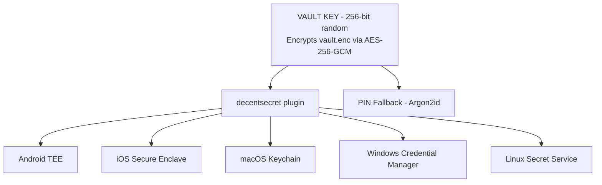
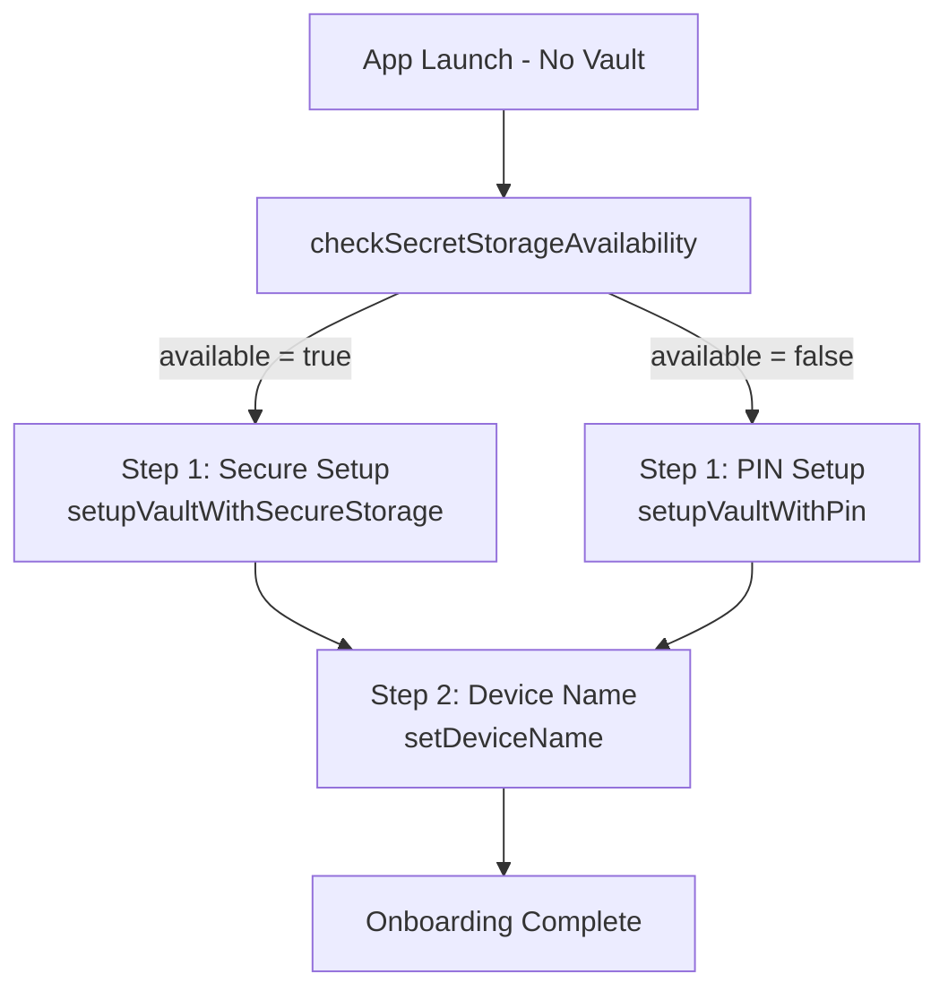
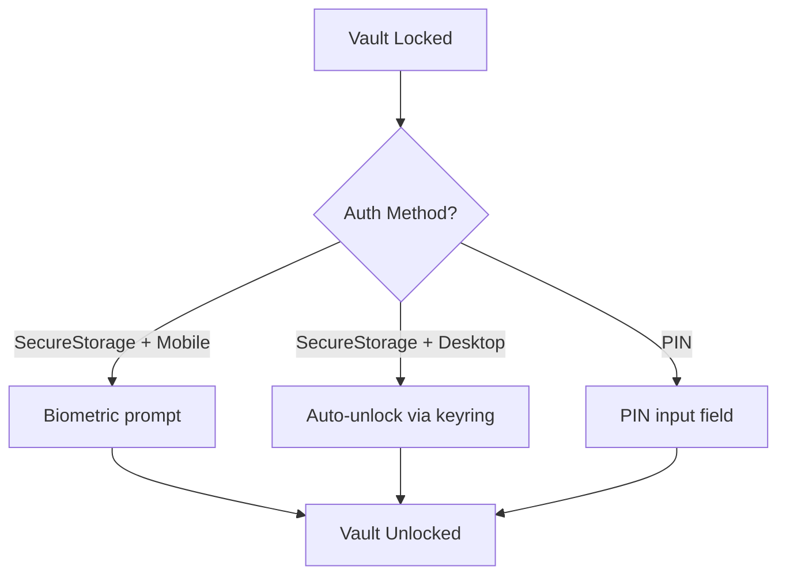

# Hardware Security Implementation Plan

## User Decisions (Confirmed)

| Decision      | Choice                                   | Implication                                       |
|---------------|------------------------------------------|---------------------------------------------------|
| Migration     | Force re-setup                           | No migration code; users factory reset on upgrade |
| Mobile auth   | Biometric-only where available           | No PIN recovery; biometric change = vault lost    |
| Desktop auth  | Keyring-only where available             | PIN only if keyring unavailable                   |
| Plugin design | Unified `decentsecret` for ALL platforms | Single API, open-source friendly                  |

---

## Architecture Overview

### Unified Security Model



### Platform Auth Matrix

| Platform | decentsecret Available | Auth Method | Key Storage           |
|----------|------------------------|-------------|-----------------------|
| Android  | Has biometrics         | Biometric   | AndroidKeyStore (TEE) |
| Android  | No biometrics          | Unavailable | PIN fallback          |
| iOS      | Has biometrics         | Biometric   | Secure Enclave        |
| iOS      | No biometrics          | Unavailable | PIN fallback          |
| macOS    | Always                 | Keyring     | macOS Keychain        |
| Windows  | Always                 | Keyring     | Credential Manager    |
| Linux    | Has Secret Service     | Keyring     | GNOME Keyring/KWallet |
| Linux    | No Secret Service      | Unavailable | PIN fallback          |

**Key insight**: App code only needs to:
1. Check if `decentsecret` is available
2. If yes, use plugin
3. If no, fall back to PIN

---

## `tauri-plugin-decentsecret` Design

### Plugin Philosophy

This plugin provides **unified secure credential storage** across all platforms:
- **Mobile**: Hardware-backed biometric authentication (TEE/Secure Enclave)
- **Desktop**: OS-provided credential storage (Keychain/Credential Manager/Secret Service)

The plugin abstracts away platform differences. Consumers see ONE API.

### Rust API (Public Interface)

```rust
// tauri-plugin-decentsecret/src/lib.rs

use serde::{Deserialize, Serialize};

/// Check what secure storage capabilities are available on this platform
#[tauri::command]
pub async fn check_availability() -> SecretStorageStatus;

/// Store a secret (vault key) in platform secure storage
/// - Android: Wraps with biometric-protected key in AndroidKeyStore
/// - iOS: Stores in Keychain with Secure Enclave protection
/// - Desktop: Stores in OS keyring
#[tauri::command]
pub async fn store_secret(secret: Vec<u8>) -> Result<(), SecretStorageError>;

/// Retrieve secret from platform secure storage
/// - Android: Shows BiometricPrompt, unwraps with TEE
/// - iOS: Shows Face ID/Touch ID, retrieves from Secure Enclave
/// - Desktop: Retrieves from OS keyring (no prompt, session-based)
#[tauri::command]
pub async fn retrieve_secret() -> Result<Vec<u8>, SecretStorageError>;

/// Delete secret from platform secure storage
#[tauri::command]
pub async fn delete_secret() -> Result<(), SecretStorageError>;

// Types

#[derive(Debug, Clone, Serialize, Deserialize)]
pub struct SecretStorageStatus {
    pub available: bool,
    pub method: Option<SecretStorageMethod>,
    pub unavailable_reason: Option<String>,
}

#[derive(Debug, Clone, Serialize, Deserialize)]
pub enum SecretStorageMethod {
    AndroidBiometric,
    IOSBiometric,
    MacOSKeychain,
    WindowsCredentialManager,
    LinuxSecretService,
}

#[derive(Debug, Clone, Serialize, Deserialize)]
pub enum SecretStorageError {
    NotAvailable,
    AuthenticationFailed,
    BiometricEnrollmentChanged,
    NoBiometricsEnrolled,
    SecretNotFound,
    AccessDenied,
    InternalError(String),
}
```

### TypeScript API

```typescript
export interface SecretStorageStatus {
  available: boolean;
  method: SecretStorageMethod | null;
  unavailable_reason: string | null;
}

export type SecretStorageMethod =
  | 'AndroidBiometric'
  | 'IOSBiometric'
  | 'MacOSKeychain'
  | 'WindowsCredentialManager'
  | 'LinuxSecretService';

export type SecretStorageError =
  | 'NotAvailable'
  | 'AuthenticationFailed'
  | 'BiometricEnrollmentChanged'
  | 'NoBiometricsEnrolled'
  | 'SecretNotFound'
  | 'AccessDenied'
  | { InternalError: string };

export async function checkAvailability(): Promise<SecretStorageStatus>;
export async function storeSecret(secret: number[]): Promise<void>;
export async function retrieveSecret(): Promise<number[]>;
export async function deleteSecret(): Promise<void>;
```

---

## Platform Implementations

### Android: `DecentsecretPlugin.kt`

**Critical security flags:**
```kotlin
KeyGenParameterSpec.Builder(KEY_ALIAS, PURPOSE_ENCRYPT or PURPOSE_DECRYPT)
    .setBlockModes(KeyProperties.BLOCK_MODE_GCM)
    .setEncryptionPaddings(KeyProperties.ENCRYPTION_PADDING_NONE)
    .setKeySize(256)
    .setUserAuthenticationRequired(true)
    .setInvalidatedByBiometricEnrollment(true)  // CRITICAL
    .setUserAuthenticationParameters(0, KeyProperties.AUTH_BIOMETRIC_STRONG)
```

**Thread safety:** Use `ConcurrentHashMap` for pending biometric operations.

### iOS: `DecentsecretPlugin.swift`

**Critical security flags:**
```swift
let accessControl = SecAccessControlCreateWithFlags(
    nil,
    kSecAttrAccessibleWhenPasscodeSetThisDeviceOnly,
    [.privateKeyUsage, .biometryCurrentSet],  // CRITICAL: invalidate on change
    nil
)

let keyParams: [String: Any] = [
    kSecAttrKeyType: kSecAttrKeyTypeECSECPrimeRandom,
    kSecAttrKeySizeInBits: 256,
    kSecAttrTokenID: kSecAttrTokenIDSecureEnclave,  // Hardware binding
    // ...
]
```

### Desktop: `desktop.rs`

Uses `keyring` crate for cross-platform OS keychain access:
- macOS: Keychain Access
- Windows: Credential Manager
- Linux: Secret Service API (GNOME Keyring, KWallet)

---

## Implementation Phases

### Phase 0: Remove Stronghold + Add Zeroize

**Goal**: Replace Stronghold with simple AES-256-GCM encrypted file.

**Why remove Stronghold:**
- Work factor disabled (0) = no security benefit
- 20+ transitive dependencies for JSON encryption
- Existing AES-256-GCM + Argon2id provides identical security

**Tasks**:
1. Add `zeroize = "1.7"` with `derive` feature
2. Remove `tauri-plugin-stronghold` and `iota_stronghold`
3. Create `vault/storage.rs` with `VaultKey` and `VaultData`
4. Update `VaultManager` to use new storage
5. Remove Stronghold plugin init from `lib.rs`

**Files**:
- `src-tauri/Cargo.toml`
- `src-tauri/src/lib.rs`
- `src-tauri/src/vault/storage.rs` (NEW)
- `src-tauri/src/vault/manager.rs`
- `src-tauri/src/vault/mod.rs`

### Phase 1: Create `tauri-plugin-decentsecret`

**Goal**: Unified plugin for ALL platforms.

**Plugin Structure**:
```
tauri-plugin-decentsecret/
├── Cargo.toml
├── build.rs
├── src/
│   ├── lib.rs
│   ├── commands.rs
│   ├── error.rs
│   ├── mobile.rs
│   └── desktop.rs
├── android/
│   └── src/main/java/.../DecentsecretPlugin.kt
├── ios/
│   └── Sources/DecentsecretPlugin.swift
└── permissions/
    └── default.toml
```

**Tasks**:
1. Create plugin directory structure
2. Implement Rust wrapper
3. Implement Android native code
4. Implement iOS native code
5. Add plugin to app's Cargo.toml
6. Register plugin in `lib.rs`

### Phase 2: VaultManager Integration

**Goal**: Wire plugin into vault system.

**AuthMethod enum**:
```rust
pub enum AuthMethod {
    SecureStorage,  // decentsecret plugin
    Pin,            // Argon2id fallback
}
```

**VaultManager methods**:
```rust
pub async fn create_with_secure_storage(app_handle: &AppHandle) -> Result<Self>;
pub async fn open_with_secure_storage(app_handle: &AppHandle) -> Result<Self>;
pub fn create_with_pin(pin: &str) -> Result<Self>;
pub fn open_with_pin(pin: &str) -> Result<Self>;
pub fn set_device_name(&mut self, name: &str) -> Result<()>;
pub fn get_device_name(&self) -> Option<&str>;
```

**Note**: Device name is NOT part of vault setup. It's set separately after vault creation and can be changed anytime.

**Files**:
- `src-tauri/src/vault/auth.rs`
- `src-tauri/src/vault/manager.rs`
- `src-tauri/src/commands.rs`

### Phase 3: Frontend Integration

**Goal**: Update UI for new auth flow.

**New TypeScript commands**:
```typescript
export async function checkSecretStorageAvailability(): Promise<SecretStorageStatus>;
export async function getRecommendedAuthMethod(): Promise<AuthMethod>;
export async function setupVaultWithSecureStorage(): Promise<void>;
export async function setupVaultWithPin(pin: string): Promise<void>;
export async function unlockVault(pin?: string): Promise<void>;
export async function setDeviceName(name: string): Promise<void>;
export async function getDeviceName(): Promise<string | null>;
```

**Onboarding flow**:



**Lock screen flow**:



**Files**:
- `src/api/commands.ts`
- `src/api/types.ts`
- `src/app.ts`

---

## Files Summary

### Phase 0: Stronghold Removal
| File                             | Action                              |
|----------------------------------|-------------------------------------|
| `src-tauri/Cargo.toml`           | Remove stronghold deps, add zeroize |
| `src-tauri/src/lib.rs`           | Remove stronghold init              |
| `src-tauri/src/vault/storage.rs` | Create - VaultKey, VaultData        |
| `src-tauri/src/vault/manager.rs` | Modify - use new storage            |

### Phase 1: Plugin Creation
| File                         | Action               |
|------------------------------|----------------------|
| `tauri-plugin-decentsecret/` | Create entire plugin |

### Phase 2: Integration
| File                             | Action                     |
|----------------------------------|----------------------------|
| `src-tauri/Cargo.toml`           | Add plugin dep             |
| `src-tauri/src/lib.rs`           | Register plugin            |
| `src-tauri/src/vault/auth.rs`    | Simplify AuthMethod        |
| `src-tauri/src/vault/manager.rs` | Add secure storage methods |
| `src-tauri/src/commands.rs`      | New auth commands          |

### Phase 3: Frontend
| File                  | Action                          |
|-----------------------|---------------------------------|
| `src/api/types.ts`    | Add new types                   |
| `src/api/commands.ts` | Add new commands                |
| `src/app.ts`          | Update onboarding + lock screen |

---

## Verification Plan

### Desktop Keyring Flow
1. Fresh install → `checkSecretStorageAvailability()` returns available
2. Onboarding → `setupVaultWithSecureStorage()` → key stored in keyring
3. Onboarding → `setDeviceName(name)` → device name saved
4. App restart → auto-unlocks via keyring

### Desktop PIN Flow (Linux without Secret Service)
1. Fresh install → `checkSecretStorageAvailability()` returns unavailable
2. Onboarding → `setupVaultWithPin(pin)` → vault created with Argon2id
3. App restart → shows PIN prompt

### Mobile Biometric Flow
1. Fresh install → `checkSecretStorageAvailability()` returns available
2. Onboarding → `setupVaultWithSecureStorage()` → biometric prompt → key in TEE/SE
3. App restart → biometric prompt
4. Biometric change → key invalidated → **vault lost** (expected)

### Mobile PIN Flow (no biometrics)
1. Fresh install → `checkSecretStorageAvailability()` returns unavailable
2. Onboarding → `setupVaultWithPin(pin)` → vault created with Argon2id
3. App restart → shows PIN prompt

---

## Risk Acknowledgment

**Accepted Risk**: Mobile biometric-only means biometric enrollment change = vault data loss.

**Mitigation**: Clear warning during setup.

**Desktop Security Note**: Keyring provides convenience (session-based auto-unlock), not per-operation security.
