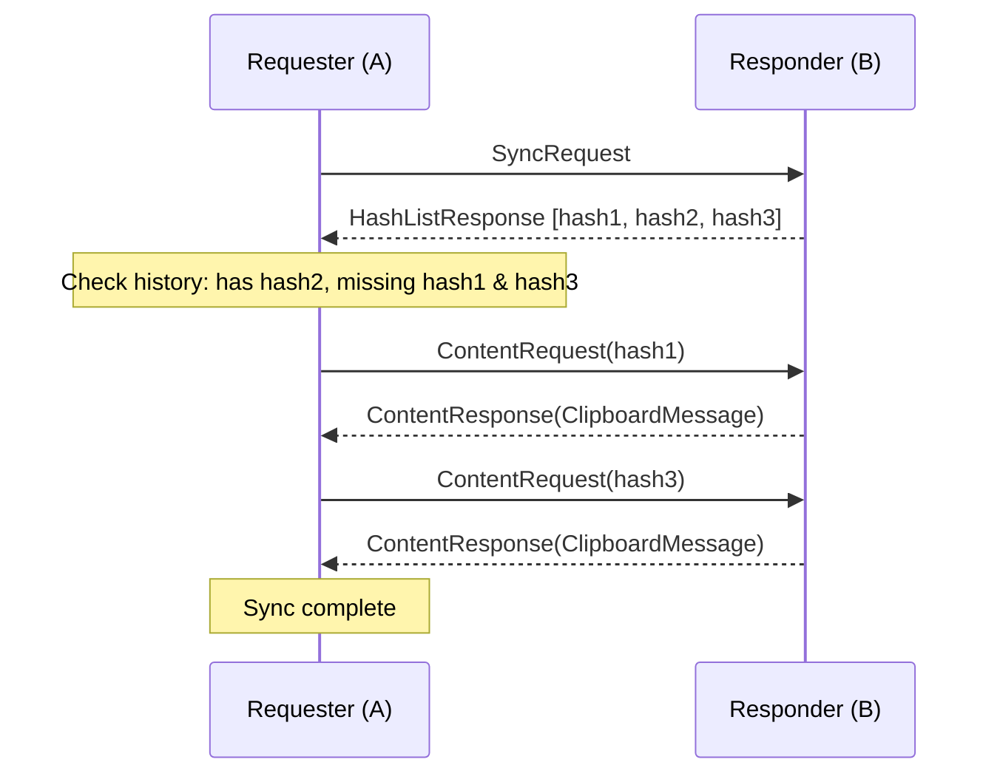
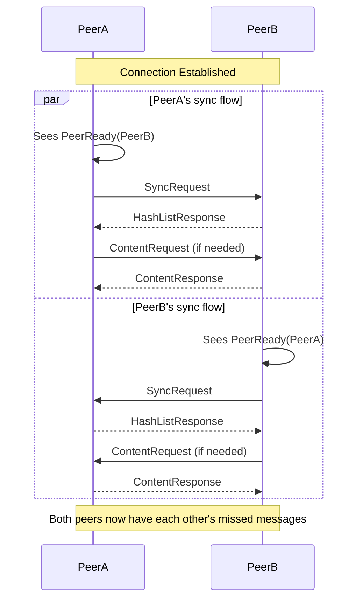
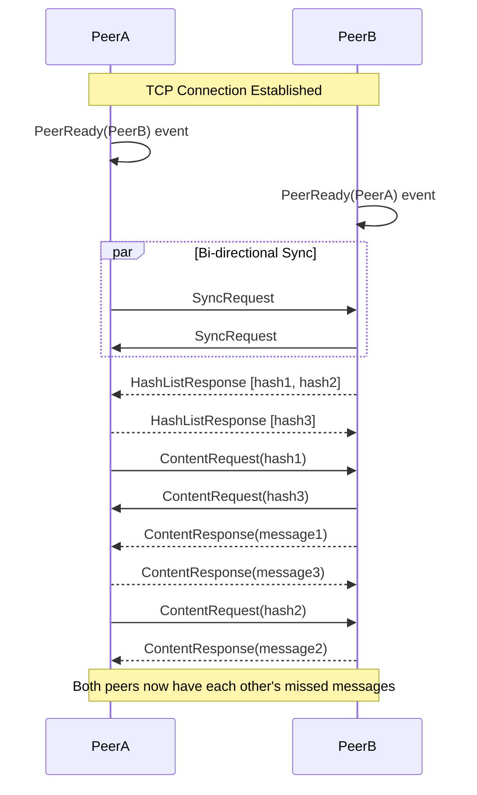

# Clipboard History Sync Implementation Plan

**Status:** Planning Phase
**Created:** January 12, 2026
**Goal:** Enable clipboard message delivery to peers who were offline when the message was originally sent

---

## Problem Statement

### Current Behavior

DecentPaste uses a **fire-and-forget** gossipsub broadcast model for clipboard synchronization:

```
User copies text → Encrypt for each paired peer → Publish to gossipsub → Online peers receive
```

**Problem:** If a peer is offline when the message is broadcast, they never receive it. They would need the original peer to copy the same text again.

### Example Scenario

```
1. PeerA copies "Hello World"
2. PeerB is offline
3. PeerC is online and receives the message
4. PeerB comes back online → Never receives "Hello World"

Expected: PeerB should receive the latest message from PeerA
Actual: PeerB receives nothing
```

### Why This Matters

- **Mobile background behavior**: When apps are backgrounded on iOS/Android, network connections are terminated
- **Desktop closure**: When users close the desktop app, they miss clipboard updates
- **User expectation**: Users expect clipboard sharing to work like Universal Clipboard - eventually consistent

---

## Design Requirements

### Functional Requirements

1. **Latest message delivery**: When a peer reconnects, they should receive the latest clipboard message from all paired peers
2. **Multiple sender support**: If PeerA and PeerB both sent messages while PeerC was offline, PeerC should receive both upon reconnection
3. **Order preservation**: Messages should be delivered in chronological order based on timestamps
4. **Deduplication**: If a peer already has a message (received previously), it should not be applied again

### Non-Functional Requirements

1. **Memory efficiency**: Buffer should use minimal memory
2. **Network efficiency**: Avoid unnecessary data transfer
3. **Future-proof**: Architecture must support future file transfer feature (large payloads)
4. **Security**: Only paired peers can participate in sync
5. **Reliability**: Handle edge cases gracefully (race conditions, dropped connections)

---

## Architectural Decisions

### Decision 1: Always Buffer for All Paired Peers

**Decision:** Store a copy of every clipboard message in memory for ALL paired peers, regardless of their online status.

**Rationale:**

| Aspect | Considered Alternative | Chosen Approach | Why |
|--------|----------------------|-----------------|-----|
| When to buffer | Only for offline peers | Always buffer for all paired peers | Solves race condition when peer goes offline mid-transmission |
| Memory impact | Not buffering | ~1KB per peer | Negligible memory cost (1 message × ~10 peers = ~10KB) |
| Complexity | Track online/offline state | No tracking needed | Simpler code, fewer edge cases |

**Benefits:**
- **No race condition**: Even if peer is in the process of going offline when we broadcast, they'll get the message on reconnection
- **Simpler logic**: No need to track online/offline state per peer
- **Reliable delivery**: Guaranteed eventual consistency

**Trade-offs:**
- **Duplicate delivery**: Peers who received the message may receive it again on reconnection
  - **Mitigation**: Hash-based deduplication on receiver side (O(1) lookup)
- **Memory usage**: 1 message per peer buffered indefinitely
  - **Mitigation**: TTL (5 minutes) + lazy cleanup on sync

---

### Decision 2: Hash-First Sync Protocol

**Decision:** Implement a two-phase sync protocol where the requester first receives a list of hashes, then requests only the content they need.

**Protocol Flow:**



**Rationale:**

| Aspect | Considered Alternative | Chosen Approach | Why |
|--------|----------------------|-----------------|-----|
| Protocol | Send all messages immediately | Send hashes first, then content on request | Future-proof for file transfers (large payloads) |
| Network overhead | Higher (sends duplicates) | Lower (sends only missing content) | Essential for files (10MB+), trivial for text |
| Complexity | Simple (1 round-trip) | Moderate (2 round-trips) | Necessary complexity for future file support |

**Why This Matters for File Support:**

Current `ClipboardMessage` stores `encrypted_content: Vec<u8>`:
- **Text**: ~1KB - trivial to duplicate
- **Files**: 10MB+ - expensive to duplicate

Future file architecture will use **content references** instead of full content:
```rust
pub struct ClipboardMessage {
    pub content_reference: Vec<u8>,  // File ID or path (small)
    pub content_type: ContentType,    // Text vs File
    // ...
}
```

Hash-first sync is **essential** for this architecture because:
- Sending file references is cheap (100 bytes)
- Sending full files on sync is expensive (10MB+)
- Hash-first avoids sending files peer already has

**Trade-offs:**
- **More protocol messages**: 2 round-trips instead of 1
  - **Mitigation**: For text, overhead is negligible (<1ms)
- **More complex code**: Need hash list management
  - **Mitigation**: Well-defined protocol, clear separation of concerns

---

### Decision 3: Per-Recipient Buffering

**Decision:** Buffer messages by recipient (peer who missed the message), not by sender.

**Buffer Structure:**

```rust
// Key = peer_id (who missed the message)
// Value = messages WE sent that THEY missed
message_buffers: HashMap<String, Vec<ClipboardMessage>>
```

**Rationale:**

When PeerA requests sync from PeerB:
- PeerB looks up buffer for PeerA: `buffer["peer_a_id"]`
- Returns only messages PeerB sent that PeerA missed

**Alternative (Per-Sender Buffering - REJECTED):**

```rust
// Key = peer_id (who sent the message)
// Value = messages THEY sent
message_buffers: HashMap<String, Vec<ClipboardMessage>>
```

Problem: When PeerA requests sync, PeerB would need to:
1. Check buffer["peer_b_id"] (messages PeerB sent)
2. Filter out messages originally from PeerA (peer shouldn't receive their own message back)
3. Return filtered list

This requires filtering logic and is semantically incorrect.

**Chosen Approach Benefits:**
- **Semantically correct**: "Messages PeerA missed" vs "Messages PeerB sent"
- **No filtering needed**: Just return buffer for requesting peer
- **Simpler code**: Direct key lookup

---

### Decision 4: Time-To-Live (TTL) with Lazy Cleanup

**Decision:** Messages expire after 5 minutes. Remove expired messages only when accessed (lazy cleanup).

**Rationale:**

| Aspect | Considered Alternative | Chosen Approach | Why |
|--------|----------------------|-----------------|-----|
| Cleanup timing | Periodic cleanup task every 5 minutes | Lazy cleanup on sync access | No periodic tasks, simpler code |
| TTL value | 30 seconds / 1 hour | 5 minutes | Sufficient for typical offline duration, doesn't consume memory indefinitely |

**Implementation:**
```rust
fn filter_expired_messages(messages: Vec<ClipboardMessage>) -> Vec<ClipboardMessage> {
    messages
        .into_iter()
        .filter(|msg| msg.timestamp > Utc::now() - Duration::from_secs(300)) // 5 minutes
        .collect()
}
```

**No periodic cleanup needed** because:
- Memory is negligible (10KB for 10 peers)
- Messages removed on sync (consumed)
- Expired messages filtered on next access

---

### Decision 5: Content Hash for Deduplication

**Decision:** Use `content_hash` (not `id`/UUID) for deduplication and sync protocol.

**Why `content_hash` instead of `id`:**

- `id` (UUID): Identifies a single broadcast event
  - Peer copies "Hello" → ID: abc-123
  - Peer copies "Hello" again → ID: def-456
  - Same content, different IDs

- `content_hash`: Identifies the clipboard content
  - Peer copies "Hello" → Hash: 5d41402abc4b2a76b9719d911017c592
  - Peer copies "Hello" again → Hash: 5d41402abc4b2a76b9719d911017c592
  - Same content, same hash

**Deduplication Logic:**

```rust
let already_has = {
    let history = state.clipboard_history.read().await;
    history.iter().any(|entry| entry.content_hash == msg.content_hash)
};

if !already_has {
    // Decrypt and apply message
}
```

This ensures the same clipboard content is never applied twice, even if broadcast multiple times.

---

### Decision 6: Strict Security - Paired Peers Only

**Decision:** All sync operations (request and response) require both peers to be in each other's paired lists.

**Security Requirements:**

| Operation | Security Check |
|-----------|-----------------|
| Send `SyncRequest` | Verify peer is in our paired list |
| Handle `SyncRequest` | Verify requester is in our paired list |
| Send `HashListResponse` | Verify recipient is in our paired list |
| Handle `HashListResponse` | Verify sender is in our paired list |
| Send `ContentRequest` | Verify peer is in our paired list |
| Handle `ContentRequest` | Verify requester is in our paired list |
| Send `ContentResponse` | Verify recipient is in our paired list |
| Handle `ContentResponse` | Verify sender is in our paired list |

**Why This Matters:**

- **Unpaired peers can't decrypt**: Without shared secret, they can't decrypt clipboard messages anyway
- **Information leakage**: Prevents untrusted peers from seeing our message buffer
- **Attack surface**: Limits sync to known, authenticated devices

**Implementation Pattern:**

```rust
fn handle_sync_message(peer_id: &str, ...) -> Result<()> {
    if !state.is_peer_paired(peer_id).await {
        warn!("Rejected sync message from unpaired peer: {}", peer_id);
        return Ok(());  // Don't process, don't error (don't leak info)
    }
    // ... process message
}
```

---

### Decision 7: Chronological History Integration

**Decision:** When sync messages arrive, insert them into clipboard history at the correct chronological position based on timestamp.

**Current Behavior:**

Remote clipboard messages are **prepended** to history:
```rust
history.insert(0, new_entry);  // Always at front
```

**New Behavior:**

Sync messages should be inserted **chronologically**:
```rust
// Find correct position by timestamp
let insert_pos = history
    .iter()
    .position(|entry| entry.timestamp < new_entry.timestamp)
    .unwrap_or(history.len());

history.insert(insert_pos, new_entry);
```

**Rationale:**

- **Accurate timeline**: Users see history in chronological order
- **Multiple syncs**: If PeerA and PeerB both sync while PeerC is offline, PeerC's history should show:
  1. PeerA's message (10:00 AM)
  2. PeerB's message (10:05 AM)
- **Consistent with existing design**: ClipboardEntry already has `timestamp` field

---

## Edge Cases and Mitigations

### Edge Case 1: Race Condition on Peer Disconnect

**Scenario:**
1. PeerA is in `ready_peers` (appears online)
2. PeerB sends clipboard message
3. PeerB publishes to gossipsub
4. PeerA disconnects mid-transmission (app closed/backgrounded)
5. PeerA never receives the message

**Mitigation:**
- **Always buffer**: PeerB buffers for PeerA regardless of online status
- **Sync on reconnection**: When PeerA reconnects, they request sync and receive the message
- **Accept small window**: Message loss window is seconds to minutes, acceptable trade-off for simplicity

**Alternative (REJECTED):** Implement heartbeat/ping-pong to detect offline status
- **Why rejected:** Complex, network overhead, still has race conditions

---

### Edge Case 2: Buffer Overflow with Rapid Copying

**Scenario:**
1. PeerA copies message 1
2. PeerA copies message 2 (5 seconds later)
3. PeerA copies message 3 (5 seconds later)
4. PeerB has been offline the entire time
5. PeerB should receive which message?

**Decision:** Buffer size = 1 message per peer. PeerB receives only message 3 (the latest).

**Rationale:**
- **User expectation**: "I copied 'Final Version', why is my clipboard showing 'Draft 1'?"
- **Memory efficiency**: Simple constant memory bound
- **Implementation**: Configurable via `MAX_BUFFER_SIZE` constant for future expansion

**Future enhancement:** Allow user to configure buffer size (1, 5, 10 messages)

---

### Edge Case 3: Sync During Active Copying

**Scenario:**
1. PeerB is offline
2. PeerA copies "Message 1"
3. PeerB comes online, requests sync
4. Before sync completes, PeerA copies "Message 2"
5. PeerB receives "Message 1" from sync
6. PeerB receives "Message 2" from live broadcast

**Result:** PeerB receives both messages in correct order (via timestamp sorting).

**Deduplication:**
- If "Message 1" arrives from sync AFTER "Message 2" from broadcast, deduplication by hash ensures no duplicate applies

---

### Edge Case 4: Multiple Peers Syncing Simultaneously

**Scenario:**
1. PeerA, PeerB, PeerC all offline
2. PeerD copies "Hello World"
3. PeerA comes online first, requests sync from PeerD
4. PeerB comes online second, requests sync from PeerD
5. PeerC comes online third, requests sync from PeerD

**Result:** All three peers receive the message independently via separate sync flows.

**Concurrency:**
- Buffers are protected by `Arc<RwLock<...>>`
- Multiple sync requests can be handled simultaneously
- Each peer receives their own copy of the message (per-recipient buffering)

---

### Edge Case 5: Expired Message in Buffer

**Scenario:**
1. PeerB is offline
2. PeerA copies "Message" at 10:00 AM
3. PeerB remains offline until 10:10 AM (5+ minutes)
4. PeerB comes online, requests sync
5. PeerB's buffer contains "Message" from 10:00 AM (expired)

**Result:** PeerB receives empty response (no messages).

**Implementation:**
```rust
let recent_messages: Vec<_> = buffer
    .into_iter()
    .filter(|msg| msg.timestamp > Utc::now() - Duration::from_secs(300))
    .collect();
```

**Rationale:**
- **Relevance**: Messages older than 5 minutes are likely stale
- **Memory hygiene**: Prevents buffer bloat over time
- **User expectation**: "I turned off my computer 2 hours ago, why is my clipboard changing?"

---

### Edge Case 6: Unpaired Peer Requests Sync

**Scenario:**
1. Unpaired PeerX connects to PeerA
2. PeerX sends `SyncRequest`
3. PeerA checks paired list
4. PeerX is NOT paired

**Result:** PeerA ignores the request (no response or empty response).

**Security:**
- Don't send error message (could leak information)
- Don't send buffer data (could reveal clipboard history)
- Return empty response (provides no useful information to attacker)

---

### Edge Case 7: Sync Request Timeout or Failure

**Scenario:**
1. PeerA comes online, sends `SyncRequest` to PeerB
2. PeerB crashes or network drops before responding
3. PeerA never receives `HashListResponse`

**Mitigation Strategy:**

**Timeout Handling:**
```rust
/// Timeout for sync operations (per round-trip)
const SYNC_TIMEOUT_SECONDS: u64 = 5;

/// Maximum retry attempts for failed sync
const SYNC_MAX_RETRIES: u32 = 2;
```

**Implementation:**

```rust
// Track pending sync requests with timeout
pub struct PendingSyncRequest {
    pub peer_id: String,
    pub started_at: DateTime<Utc>,
    pub retry_count: u32,
}

// In network event loop, check for timeouts
fn check_sync_timeouts(&mut self) {
    let now = Utc::now();
    let timeout = Duration::from_secs(SYNC_TIMEOUT_SECONDS);

    self.pending_syncs.retain(|req| {
        if now - req.started_at > timeout {
            if req.retry_count < SYNC_MAX_RETRIES {
                // Retry
                warn!("Sync timeout for {}, retrying ({}/{})",
                    req.peer_id, req.retry_count + 1, SYNC_MAX_RETRIES);
                self.retry_sync(&req.peer_id, req.retry_count + 1);
                false // Remove old request, retry will create new one
            } else {
                // Give up
                warn!("Sync failed for {} after {} retries",
                    req.peer_id, SYNC_MAX_RETRIES);
                false
            }
        } else {
            true // Keep waiting
        }
    });
}
```

**Retry on Next Connection:**
- If sync completely fails, no data loss occurs
- Buffer remains intact on the sender side
- Next `PeerReady` event triggers a fresh sync attempt
- This provides natural recovery without complex state machines

**Acceptable Failure Modes:**
- Silent failure is acceptable for sync (user still has gossipsub for real-time)
- Failed sync = peer misses old messages but receives new ones via gossipsub
- Next reconnection will retry sync automatically

---

### Edge Case 8: Bi-Directional Sync on Connection

**Scenario:**
1. PeerA and PeerB are both paired
2. PeerA has messages buffered for PeerB (PeerB was offline)
3. PeerB has messages buffered for PeerA (PeerA was offline)
4. They connect to each other

**How It Works:**

The sync is **bi-directional** because `PeerReady` fires on BOTH sides:



**Both peers request sync from each other simultaneously:**
- PeerA → PeerB: "What messages do you have for me?"
- PeerB → PeerA: "What messages do you have for me?"

**Result:** Both sides receive missed messages. The sync is symmetric.

**Concurrency:**
- Both sync flows happen in parallel
- No coordination needed - each peer handles incoming requests independently
- `Arc<RwLock<...>>` protects shared state

---

## Implementation Plan

### Phase 1: Protocol Layer

**File:** `src-tauri/src/network/protocol.rs`

**Add sync protocol messages:**

```rust
#[derive(Debug, Clone, Serialize, Deserialize)]
pub enum ProtocolMessage {
    // ... existing messages ...
    Sync(SyncMessage),
}

#[derive(Debug, Clone, Serialize, Deserialize)]
pub enum SyncMessage {
    Request {
        peer_id: String,
    },
    HashListResponse {
        hashes: Vec<MessageHash>,
    },
    ContentRequest {
        hash: String,
    },
    ContentResponse {
        message: ClipboardMessage,
    },
}

#[derive(Debug, Clone, Serialize, Deserialize)]
pub struct MessageHash {
    pub hash: String,  // content_hash from ClipboardMessage
    pub timestamp: DateTime<Utc>,
}
```

**Notes:**
- `MessageHash` includes `timestamp` for chronological sorting on requester side
- No `origin_device_id` - we only buffer messages from our own device
- `ContentResponse` includes full `ClipboardMessage` (with encrypted content)

---

### Phase 2: Event Layer

**File:** `src-tauri/src/network/events.rs`

**Add sync events:**

```rust
#[derive(Debug, Clone)]
pub enum NetworkEvent {
    // ... existing events ...

    // Sync events
    HashListResponse {
        peer_id: String,
        hashes: Vec<super::protocol::MessageHash>,
    },
    ContentResponse {
        message: super::protocol::ClipboardMessage,
    },
}
```

**Rationale:**
- Sync events are emitted from swarm to lib.rs for processing
- `HashListResponse` contains list of available hashes
- `ContentResponse` contains full message (after ContentRequest)

---

### Phase 3: State Management

**File:** `src-tauri/src/state.rs`

**Add buffer storage to `AppState`:**

```rust
/// Tracks a pending sync request for timeout handling
#[derive(Debug, Clone)]
pub struct PendingSyncRequest {
    pub peer_id: String,
    pub started_at: DateTime<Utc>,
    pub retry_count: u32,
}

pub struct AppState {
    // ... existing fields ...

    /// Message buffers for offline peers.
    /// Maps peer_id -> buffered messages (messages WE sent that THEY missed).
    /// Key = peer who missed the message (recipient)
    /// Value = messages we sent (max 1 per peer, configurable)
    pub message_buffers: Arc<RwLock<HashMap<String, Vec<ClipboardMessage>>>>,

    /// Tracks pending sync requests for timeout and retry handling.
    /// Entries are added when SyncRequest is sent, removed when HashListResponse is received.
    pub pending_syncs: Arc<RwLock<Vec<PendingSyncRequest>>>,
}
```

**Add buffer management methods:**

```rust
impl AppState {
    /// Store a clipboard message in buffer for a specific peer.
    /// Always buffers, regardless of peer's online status.
    pub async fn store_buffered_message(&self, peer_id: &str, message: ClipboardMessage) {
        let mut buffers = self.message_buffers.write().await;
        let buffer = buffers.entry(peer_id.to_string()).or_insert_with(Vec::new);
        buffer.push(message);

        // Truncate to max size
        const MAX_BUFFER_SIZE: usize = 1;
        if buffer.len() > MAX_BUFFER_SIZE {
            buffer.drain(0..buffer.len() - MAX_BUFFER_SIZE);
        }
    }

    /// Get buffer for a specific peer (read-only, does NOT remove).
    /// Used for building hash list in SyncRequest response.
    /// Buffer is only consumed when specific content is requested via ContentRequest.
    pub async fn get_buffer_for_peer(&self, peer_id: &str) -> Vec<ClipboardMessage> {
        let buffers = self.message_buffers.read().await;
        buffers.get(peer_id).cloned().unwrap_or_default()
    }

    /// Find a message by content_hash for a SPECIFIC peer's buffer.
    /// Used when peer requests specific content via ContentRequest.
    /// IMPORTANT: Only searches the requesting peer's buffer to ensure correct encryption.
    pub async fn find_message_for_peer_by_hash(&self, peer_id: &str, hash: &str) -> Option<ClipboardMessage> {
        let buffers = self.message_buffers.read().await;
        if let Some(buffer) = buffers.get(peer_id) {
            for message in buffer {
                if message.content_hash == hash {
                    return Some(message.clone());
                }
            }
        }
        None
    }

    /// Remove a specific message from a specific peer's buffer by content_hash.
    /// Called after peer successfully receives content via ContentResponse.
    pub async fn remove_buffered_message_for_peer(&self, peer_id: &str, hash: &str) {
        let mut buffers = self.message_buffers.write().await;
        if let Some(buffer) = buffers.get_mut(peer_id) {
            buffer.retain(|msg| msg.content_hash != hash);
        }
    }
}
```

---

### Phase 4: Network Command Layer

**File:** `src-tauri/src/network/swarm.rs`

**Add sync commands to `NetworkCommand` enum:**

```rust
pub enum NetworkCommand {
    // ... existing commands ...

    /// Request sync from a specific peer (hash-first protocol).
    RequestSync {
        peer_id: String,
    },

    /// Request full content for a specific hash (after receiving HashListResponse).
    RequestContent {
        peer_id: String,
        hash: String,
    },
}
```

---

### Phase 5: Network Event Handlers

**File:** `src-tauri/src/network/swarm.rs`

**Handle incoming sync messages in `handle_swarm_event()`:**

**5.1 Handle `SyncRequest`:**

```rust
request_response::Message::Request { request, channel, .. } => {
    if let Ok(ProtocolMessage::Sync(SyncMessage::Request { peer_id })) =
        ProtocolMessage::from_bytes(&request.message)
    {
        // SECURITY: Verify peer is paired
        if !state.is_peer_paired(&peer_id).await {
            warn!("Rejected SyncRequest from unpaired peer: {}", peer_id);
            return;
        }

        // Get buffer for this peer (read-only, does NOT remove)
        // Buffer is only consumed when specific content is requested via ContentRequest
        let buffer = state.get_buffer_for_peer(&peer_id).await;

        // Filter expired messages (5 minute TTL)
        let recent_messages: Vec<_> = buffer
            .into_iter()
            .filter(|msg| msg.timestamp > Utc::now() - Duration::from_secs(300))
            .collect();

        // Build hash list (no content, no encryption - just hashes)
        // The actual content is sent later via ContentRequest/ContentResponse
        let hashes: Vec<_> = recent_messages
            .iter()
            .map(|msg| MessageHash {
                hash: msg.content_hash.clone(),
                timestamp: msg.timestamp,
            })
            .collect();

        // Send response with hash list only
        let sync_msg = SyncMessage::HashListResponse { hashes };
        let protocol_msg = ProtocolMessage::Sync(sync_msg);
        if let Ok(message) = protocol_msg.to_bytes() {
            let response = PairingResponse { message };
            if self
                .swarm
                .behaviour_mut()
                .request_response
                .send_response(channel, response)
                .is_err()
            {
                warn!("Failed to send HashListResponse to {}", peer_id);
            }
        }
    }
}
```

**5.2 Handle `ContentRequest`:**

```rust
request_response::Message::Request { request, channel, .. } => {
    if let Ok(ProtocolMessage::Sync(SyncMessage::ContentRequest { hash })) =
        ProtocolMessage::from_bytes(&request.message)
    {
        // SECURITY: Verify peer is paired
        let peer_str = peer.to_string();
        if !state.is_peer_paired(&peer_str).await {
            warn!("Rejected ContentRequest from unpaired peer: {}", peer);
            return;
        }

        // Find message by hash in THIS PEER'S buffer only
        // This ensures we return the correctly encrypted message for this peer
        if let Some(message) = state.find_message_for_peer_by_hash(&peer_str, &hash).await {
            // Send response with full message (already encrypted for this peer)
            let sync_msg = SyncMessage::ContentResponse { message };
            let protocol_msg = ProtocolMessage::Sync(sync_msg);
            if let Ok(msg_bytes) = protocol_msg.to_bytes() {
                let response = PairingResponse { message: msg_bytes };
                if self
                    .swarm
                    .behaviour_mut()
                    .request_response
                    .send_response(channel, response)
                    .is_ok()
                {
                    // Remove from buffer after successful send
                    state.remove_buffered_message_for_peer(&peer_str, &hash).await;
                    debug!("Sent ContentResponse to {} for hash {}", peer, hash);
                } else {
                    warn!("Failed to send ContentResponse to {}", peer);
                }
            }
        } else {
            debug!("No message found for hash {} in buffer for peer {}", hash, peer);
        }
    }
}
```

**5.3 Handle `HashListResponse`:**

```rust
request_response::Message::Response { response, .. } => {
    if let Ok(ProtocolMessage::Sync(SyncMessage::HashListResponse { hashes })) =
        ProtocolMessage::from_bytes(&response.message)
    {
        // SECURITY: Verify sender is paired
        let peer_str = peer.to_string();
        if !state.is_peer_paired(&peer_str).await {
            warn!("Rejected HashListResponse from unpaired peer: {}", peer);
            return;
        }

        // Emit to lib.rs for processing
        let _ = self.event_tx.send(NetworkEvent::HashListResponse {
            peer_id: peer_str,
            hashes,
        }).await;
    }
}
```

**5.4 Handle `ContentResponse`:**

```rust
request_response::Message::Response { response, .. } => {
    if let Ok(ProtocolMessage::Sync(SyncMessage::ContentResponse { message })) =
        ProtocolMessage::from_bytes(&response.message)
    {
        // SECURITY: Verify sender is paired
        let peer_str = peer.to_string();
        if !state.is_peer_paired(&peer_str).await {
            warn!("Rejected ContentResponse from unpaired peer: {}", peer);
            return;
        }

        // Emit to lib.rs for processing
        let _ = self.event_tx.send(NetworkEvent::ContentResponse { message }).await;
    }
}
```

---

### Phase 6: Broadcast Buffering

**File:** `src-tauri/src/lib.rs`

**Modify clipboard broadcast handler (around line 457-503):**

```rust
// When broadcasting clipboard change (in clipboard_rx.recv() loop)
for peer in paired_peers.iter() {
    // 1. Encrypt for this peer
    let encrypted = security::encrypt_content(
        change.content.as_bytes(),
        &peer.shared_secret,
    )?;

    let msg = ClipboardMessage {
        id: uuid::Uuid::new_v4().to_string(),
        content_hash: change.content_hash.clone(),
        encrypted_content: encrypted,
        timestamp: Utc::now(),
        origin_device_id: identity.device_id.clone(),
        origin_device_name: identity.device_name.clone(),
    };

    // 2. Send via gossipsub (fire-and-forget)
    network_cmd_tx_clipboard.send(NetworkCommand::BroadcastClipboard {
        message: msg.clone(),
    }).await;

    // 3. ALWAYS buffer for this paired peer (even if online)
    state.store_buffered_message(&peer.peer_id, msg).await;
}
```

---

### Phase 7: Sync Request Trigger (Bi-Directional)

**File:** `src-tauri/src/lib.rs`

**Add sync request on `PeerReady` event:**

The `PeerReady` event fires on BOTH sides when a connection is established:
- PeerA sees `PeerReady(PeerB)` → PeerA requests sync FROM PeerB
- PeerB sees `PeerReady(PeerA)` → PeerB requests sync FROM PeerA

This creates **bi-directional sync** where both peers exchange missed messages.

```rust
NetworkEvent::PeerReady { peer_id, device_name } => {
    // Check if peer is paired before requesting sync
    if state.is_peer_paired(&peer_id).await {
        // Request sync FROM this peer (they may have messages for us)
        // Note: This is bi-directional - the other peer will also request sync from us
        info!("Peer {} ({}) is ready, requesting sync", device_name, peer_id);

        // Track pending sync for timeout handling
        let pending = PendingSyncRequest {
            peer_id: peer_id.clone(),
            started_at: Utc::now(),
            retry_count: 0,
        };
        state.pending_syncs.write().await.push(pending);

        if let Err(e) = network_cmd_tx.send(NetworkCommand::RequestSync {
            peer_id: peer_id.clone(),
        }).await {
            error!("Failed to send sync request to {}: {}", peer_id, e);
        }
    } else {
        debug!("Peer {} is not paired, skipping sync", peer_id);
    }

    // ... existing PeerReady logic ...
}
```

**Data Flow:**



---

### Phase 8: Sync Event Processing

**File:** `src-tauri/src/lib.rs`

**Add handlers for sync events in network event loop:**

**8.1 Handle `HashListResponse`:**

```rust
NetworkEvent::HashListResponse { peer_id, hashes } => {
    // SECURITY: Already verified in swarm.rs, but double-check
    if !state.is_peer_paired(&peer_id).await {
        warn!("Ignoring HashListResponse from unpaired peer: {}", peer_id);
        return;
    }

    // Remove from pending syncs (we got a response, no need for timeout)
    {
        let mut pending = state.pending_syncs.write().await;
        pending.retain(|req| req.peer_id != peer_id);
    }

    // Filter hashes we don't have in our history
    let needed_hashes: Vec<String> = {
        let history = state.clipboard_history.read().await;
        let hash_set: HashSet<&str> = history
            .iter()
            .map(|entry| entry.content_hash.as_str())
            .collect();

        hashes
            .into_iter()
            .filter(|h| !hash_set.contains(h.hash.as_str()))
            .map(|h| h.hash)
            .collect()
    };

    if !needed_hashes.is_empty() {
        info!("Requesting {} missing messages from {}", needed_hashes.len(), peer_id);

        for hash in needed_hashes {
            if let Err(e) = network_cmd_tx.send(NetworkCommand::RequestContent {
                peer_id: peer_id.clone(),
                hash,
            }).await {
                error!("Failed to send ContentRequest: {}", e);
            }
        }
    } else {
        debug!("No missing messages from {}", peer_id);
    }
}
```

**8.2 Handle `ContentResponse`:**

```rust
NetworkEvent::ContentResponse { message } => {
    let origin_id = message.origin_device_id.clone();

    // SECURITY: Verify peer is paired
    if !state.is_peer_paired(&origin_id).await {
        warn!("Ignoring ContentResponse from unpaired peer: {}", origin_id);
        return;
    }

    // Find peer's shared secret for decryption
    let paired_peers = state.paired_peers.read().await;
    let peer = paired_peers.iter().find(|p| p.peer_id == origin_id);

    if let Some(peer) = peer {
        // Decrypt content
        let content = match security::decrypt_content(
            &message.encrypted_content,
            &peer.shared_secret,
        ) {
            Ok(bytes) => String::from_utf8(bytes).unwrap(),
            Err(e) => {
                error!("Failed to decrypt content from {}: {}", origin_id, e);
                return;
            }
        };

        // Verify hash
        let hash = security::hash_content(&content);
        if hash != message.content_hash {
            warn!("Hash mismatch for message from {}", origin_id);
            return;
        }

        // Check if we already have this (deduplication)
        let already_has = {
            let history = state.clipboard_history.read().await;
            history.iter().any(|entry| entry.content_hash == hash)
        };

        if !already_has {
            // Set clipboard
            if let Err(e) = clipboard::monitor::set_clipboard_content(
                &app_handle,
                &content,
            ) {
                error!("Failed to set clipboard: {}", e);
                return;
            }

            // Add to history (will sort by timestamp)
            let entry = ClipboardEntry::new_remote(
                content,
                hash,
                message.timestamp,
                &message.origin_device_id,
                &message.origin_device_name,
            );
            state.add_clipboard_entry(entry.clone()).await;

            // Emit to frontend
            let _ = app_handle.emit("clipboard-received", entry);

            info!("Successfully synced message from {}", origin_id);
        } else {
            debug!("Message from {} already in history (duplicate)", origin_id);
        }

        // NOTE: Buffer is already removed on the SENDER side when ContentResponse is sent
        // (see Phase 5.2). No need to remove here on receiver side.
    } else {
        warn!("Received content from unknown peer: {}", origin_id);
    }
}
```

---

### Phase 9: History Insertion by Timestamp

**File:** `src-tauri/src/state.rs`

**Modify `add_clipboard_entry()` to insert chronologically:**

```rust
pub async fn add_clipboard_entry(&self, entry: ClipboardEntry) {
    let modified = {
        let mut history = self.clipboard_history.write().await;

        // Check for existing entry with same content hash
        if let Some(idx) = history
            .iter()
            .position(|e| e.content_hash == entry.content_hash)
        {
            // Update existing entry and move to front
            history.remove(idx);
        }

        // Insert at correct chronological position
        let insert_pos = history
            .iter()
            .position(|e| e.timestamp < entry.timestamp)
            .unwrap_or(history.len());
        history.insert(insert_pos, entry);

        // Trim to max size
        let max_size = self.settings.read().await.clipboard_history_limit;
        if history.len() > max_size {
            history.truncate(max_size);
        }

        true
    };

    if modified {
        if let Err(e) = self.flush_clipboard_history().await {
            warn!("Failed to flush clipboard history: {}", e);
        }
    }
}
```

---

## Testing Plan

### Test Case 1: Single Peer Reconnect

**Setup:**
- 3 peers: PeerA, PeerB, PeerC (all paired)
- PeerB offline

**Steps:**
1. PeerA copies "Hello World"
2. PeerB comes online
3. Verify PeerB receives "Hello World" via sync

**Expected:**
- PeerB's clipboard = "Hello World"
- PeerB's history contains message from PeerA
- PeerA's buffer for PeerB is consumed (removed)

---

### Test Case 2: Multiple Senders

**Setup:**
- 3 peers: PeerA, PeerB, PeerC (all paired)
- PeerC offline

**Steps:**
1. PeerA copies "From PeerA" at 10:00 AM
2. PeerB copies "From PeerB" at 10:05 AM
3. PeerC comes online at 10:10 AM
4. PeerC connects to both PeerA and PeerB

**Expected:**
- PeerC receives both messages via sync
- PeerC's history shows:
  1. "From PeerA" (10:00 AM)
  2. "From PeerB" (10:05 AM)
- Messages are in chronological order

---

### Test Case 3: Deduplication

**Setup:**
- 3 peers: PeerA, PeerB, PeerC (all paired)
- All peers online

**Steps:**
1. PeerA copies "Hello World"
2. PeerB and PeerC receive via gossipsub
3. PeerB goes offline
4. PeerB comes online
5. PeerB requests sync from PeerA

**Expected:**
- PeerB receives "Hello World" via sync
- Deduplication prevents duplicate clipboard updates
- History contains only one entry for "Hello World"

---

### Test Case 4: TTL Expiration

**Setup:**
- 3 peers: PeerA, PeerB, PeerC (all paired)
- PeerB offline

**Steps:**
1. PeerA copies "Message 1" at 10:00 AM
2. PeerB remains offline until 10:10 AM (> 5 minutes)
3. PeerB comes online, requests sync from PeerA

**Expected:**
- PeerB receives empty response (no messages)
- PeerB's clipboard unchanged

---

### Test Case 5: Security - Unpaired Peer

**Setup:**
- 3 peers: PeerA, PeerB, PeerC
- PeerA and PeerB are paired
- PeerC is NOT paired with anyone

**Steps:**
1. PeerC connects to PeerA
2. PeerC sends `SyncRequest` to PeerA

**Expected:**
- PeerA rejects the request
- No response (or empty response)
- PeerA's buffer is not exposed

---

### Test Case 6: Rapid Copying

**Setup:**
- 3 peers: PeerA, PeerB, PeerC (all paired)
- PeerB offline

**Steps:**
1. PeerA copies "Message 1" at 10:00 AM
2. PeerA copies "Message 2" at 10:01 AM
3. PeerA copies "Message 3" at 10:02 AM
4. PeerB comes online, requests sync from PeerA

**Expected:**
- PeerB receives only "Message 3" (latest)
- Buffer size = 1 (configurable)
- Messages 1 and 2 were evicted from buffer

---

### Test Case 7: Sync Timeout and Retry

**Setup:**
- 2 peers: PeerA, PeerB (paired)
- Network is unreliable

**Steps:**
1. PeerB comes online
2. PeerB sends SyncRequest to PeerA
3. Simulate network failure (PeerA doesn't respond)
4. Wait for timeout (5 seconds)
5. Verify retry is attempted
6. After max retries, verify sync is abandoned

**Expected:**
- First timeout triggers retry (logged as warning)
- Second timeout triggers another retry
- Third timeout (if configured) abandons sync
- No crash or hang
- Next PeerReady event will retry fresh

---

### Test Case 8: Bi-Directional Sync

**Setup:**
- 2 peers: PeerA, PeerB (paired)
- Both were offline at different times

**Steps:**
1. PeerA copies "From A" while PeerB is offline
2. PeerB copies "From B" while PeerA is offline
3. Both come online and connect

**Expected:**
- PeerA receives "From B" (from PeerB's buffer)
- PeerB receives "From A" (from PeerA's buffer)
- Both histories contain both messages in chronological order
- Sync is symmetric (both directions complete)

---

## Documentation Updates

After implementation, update existing documentation:

### Update `ARCHITECTURE.md`

**Add new section: "Clipboard History Sync"**

Include:
- Overview of sync protocol (hash-first)
- Buffer storage architecture (per-recipient)
- Security model (paired peers only)
- Data flow diagrams
- Integration with existing gossipsub model

### Update `SECURITY.md`

**Add new section: "Sync Protocol Security"**

Include:
- Security requirements for sync operations
- Paired peer verification (request + response)
- Attack vectors and mitigations:
  - Unpaired peer requesting sync
  - Information leakage via buffer access
  - Replay attacks (mitigated by TTL + deduplication)

### Update `AGENTS.md`

**Add notes for future AI agents:**

- Sync protocol is hash-first (prepare for file support)
- Always buffer for paired peers
- Security: verify paired status on ALL sync operations
- TTL is 5 minutes with lazy cleanup

---

## Post-Implementation Tasks

### 1. Write Technical Article

**Goal:** Share implementation decisions with the engineering community (r/rust, r/privacy, r/libp2p)

**Article Structure:**

1. **Introduction**
   - Problem: Offline peers miss clipboard messages
   - Why this matters for clipboard sharing apps
   - Real-world use cases

2. **Design Requirements**
   - Functional: Latest message delivery, multiple senders, order preservation
   - Non-functional: Memory, network efficiency, security, future-proofing

3. **Architectural Decisions**

   **3.1 Always Buffer Strategy**
   - Why buffer for all peers (not just offline)?
   - Race condition on disconnect (app closing, mobile backgrounding)
   - Trade-offs: Memory vs. simplicity
   - Decision: Always buffer + hash deduplication

   **3.2 Hash-First Sync Protocol**
   - Two-phase protocol: Hash list → Content request
   - Why not send all messages immediately?
   - Future-proofing for file transfers (10MB+ payloads)
   - Trade-offs: More round-trips vs. network efficiency

   **3.3 Per-Recipient Buffering**
   - Buffer by recipient (who missed) vs. sender (who sent)
   - Why per-recipient is semantically correct
   - No filtering logic needed

   **3.4 TTL and Lazy Cleanup**
   - 5-minute expiration
   - Why no periodic cleanup task?
   - Memory is negligible (~10KB for 10 peers)

   **3.5 Security Model**
   - Paired peers only (request + response)
   - Why unpaired peers shouldn't access buffer
   - Information leakage prevention

4. **Implementation Details**
   - Protocol layer (SyncMessage enum)
   - State management (message_buffers HashMap)
   - Event handling (sync triggers on PeerReady)
   - Deduplication by content_hash

5. **Edge Cases and Mitigations**
   - Race condition on disconnect
   - Buffer overflow with rapid copying
   - Sync during active copying
   - Multiple peers syncing simultaneously
   - Expired message in buffer
   - Unpaired peer requesting sync

6. **Lessons Learned**
   - Simplicity vs. optimization
   - Future-proofing vs. over-engineering
   - Security by default (paired peer verification)
   - Hash-first protocol as a pattern for other sync operations

7. **Alternative Approaches Considered**
   - Track online/offline state (rejected: complex, still has race conditions)
   - Periodic cleanup task (rejected: unnecessary overhead)
   - Send all messages immediately (rejected: inefficient for files)
   - Per-sender buffering (rejected: requires filtering logic)

8. **Conclusion**
   - Why this design works for DecentPaste
   - Reusability for other P2P sync scenarios
   - Future work (file transfers, configurable buffer size)

**Tone:**
- Technical but accessible
- Acknowledge trade-offs honestly
- Avoid "my solution is perfect" - present reasoning
- Invite constructive feedback
- Emphasize learning and iteration

**Platforms to share:**
- r/rust - Rust implementation details, libp2p usage
- r/privacy - Clipboard privacy, encryption, P2P architecture
- r/libp2p - Decentralized networking, gossipsub patterns
- r/DecentPaste - App-specific feature announcement

---

### 2. Update README.md

**Add section: "Clipboard History Sync"**

Include:
- Feature overview
- How it works (user-facing)
- Security notes

---

### 3. Add Code Comments

**Add inline comments for:**
- Why we always buffer (decision rationale)
- Why we verify paired status (security)
- Why we use hash-first protocol (future-proofing)
- Why we deduplicate by content_hash

Example:
```rust
// ALWAYS buffer for paired peers, even if they appear online.
// This handles the race condition where peer goes offline mid-transmission
// (e.g., app closes, mobile backgrounds). Sync ensures eventual delivery.
state.store_buffered_message(&peer.peer_id, msg).await;
```

---

### 4. Write GitHub Wiki Page

**Goal:** Create a user-facing and developer-facing wiki page explaining the Clipboard History Sync feature.

**Wiki Page Structure:**

1. **Overview**
   - What problem does this solve?
   - How does it work from a user perspective?
   - When does sync happen?

2. **How It Works (Technical)**
   - Hash-first sync protocol explanation
   - Diagram of the sync flow
   - Buffering strategy (always buffer, per-recipient)

3. **Configuration**
   - TTL (5 minutes default)
   - Buffer size (1 message per peer default)
   - Future: user-configurable settings

4. **Security**
   - Only paired peers can sync
   - End-to-end encryption preserved
   - No information leakage to unpaired peers

5. **Limitations**
   - Buffer size = 1 (only latest message synced)
   - TTL = 5 minutes (older messages expire)
   - Requires both peers to be online simultaneously for sync

6. **FAQ**
   - "Why didn't I receive a message from 2 hours ago?" → TTL expired
   - "Why do I only see the latest message?" → Buffer size = 1
   - "Does this work across networks?" → No, mDNS is local only

**Location:** `https://github.com/<org>/decentpaste/wiki/Clipboard-History-Sync`

---

## Configuration Constants

Add these constants to `state.rs` for easy tuning:

```rust
/// Maximum number of messages to buffer per peer.
/// Set to 1 for "latest only" behavior.
/// Set to 10 to support rapid copying scenarios.
/// Future: Make this user-configurable in settings.
const MAX_BUFFER_SIZE: usize = 1;

/// Time-to-live for buffered messages.
/// Messages older than this are filtered out during sync.
/// 5 minutes is sufficient for typical offline durations (app restart, mobile background).
/// Future: Make this user-configurable in settings.
const SYNC_TTL_SECONDS: u64 = 300;

/// Timeout for each sync round-trip (SyncRequest → HashListResponse, ContentRequest → ContentResponse).
/// If no response within this time, the request is considered failed.
const SYNC_TIMEOUT_SECONDS: u64 = 5;

/// Maximum number of retry attempts for failed sync requests.
/// After this many failures, give up and wait for next PeerReady event.
const SYNC_MAX_RETRIES: u32 = 2;
```

---

## Future Enhancements

### 1. User-Configurable Buffer Size

Allow users to configure buffer size in settings:
- 1 message (current default)
- 5 messages (moderate)
- 10 messages (power users)

### 2. Configurable TTL

Allow users to configure sync TTL:
- 1 minute (stale data avoidance)
- 5 minutes (current default)
- 30 minutes (extended offline support)

### 3. File Transfer Support

When file upload is implemented:
- Change `ClipboardMessage.encrypted_content` to `content_reference`
- Hash-first sync protocol already handles this (sends small references)
- Add file download logic on `ContentResponse`

### 4. Sync Progress Indicator

Show UI feedback during sync:
- "Syncing with 3 peers..."
- "Received 2/3 messages from PeerA"
- "Sync complete"

### 5. Sync History

Show sync history in logs/debug view:
- When sync was requested
- Which messages were synced
- From which peers

---

## Risks and Mitigations

| Risk | Impact | Mitigation |
|------|--------|------------|
| **Memory growth** if buffer size increases | Medium | Lazy cleanup, TTL expiration, monitor buffer size |
| **Network overhead** from hash-first protocol | Low | Hash lists are tiny (bytes), overhead is negligible |
| **Sync spam** if peer constantly reconnects | Low | Deduplication prevents duplicate updates |
| **Security bypass** if paired check is missed | Critical | Security-focused code review, add tests for unpaired peers |
| **Race conditions** in concurrent sync | Low | `Arc<RwLock<...>>` protects all shared state |
| **Message loss** if buffer is full | Low | Buffer overflow handled (keep latest only) |

---

## Success Criteria

Implementation is successful when:

1. ✅ Offline peers receive latest clipboard message on reconnection
2. ✅ Multiple senders' messages are all delivered in correct order
3. ✅ Deduplication prevents duplicate clipboard updates
4. ✅ Security model prevents unpaired peers from accessing sync data
5. ✅ Memory usage remains <100KB for typical use (10 peers)
6. ✅ Network overhead remains minimal (hash lists < 1KB)
7. ✅ All edge cases are handled gracefully
8. ✅ Documentation is updated (ARCHITECTURE.md, SECURITY.md)
9. ✅ Article is written for community sharing
10. ✅ Code is well-commented with design rationale
11. ✅ GitHub wiki page is published (user-facing + developer-facing)

---

## Implementation Checklist

- [ ] Phase 1: Protocol layer (SyncMessage, MessageHash)
- [ ] Phase 2: Event layer (HashListResponse, ContentResponse)
- [ ] Phase 3: State management (buffer storage, helper methods, PendingSyncRequest)
- [ ] Phase 4: Network commands (RequestSync, RequestContent)
- [ ] Phase 5: Network event handlers (sync message processing)
- [ ] Phase 6: Broadcast buffering (always buffer for paired peers)
- [ ] Phase 7: Sync trigger (PeerReady → RequestSync, bi-directional)
- [ ] Phase 8: Sync event processing (HashListResponse, ContentResponse)
- [ ] Phase 9: Chronological history insertion
- [ ] Phase 10: Timeout handling and retry logic
- [ ] Test Case 1: Single peer reconnect
- [ ] Test Case 2: Multiple senders
- [ ] Test Case 3: Deduplication
- [ ] Test Case 4: TTL expiration
- [ ] Test Case 5: Security - unpaired peer
- [ ] Test Case 6: Rapid copying
- [ ] Test Case 7: Sync timeout and retry
- [ ] Test Case 8: Bi-directional sync (both peers exchange messages)
- [ ] Update ARCHITECTURE.md (add Clipboard History Sync section)
- [ ] Update SECURITY.md (add Sync Protocol Security section)
- [ ] Update AGENTS.md (add sync notes)
- [ ] Write technical article for community
- [ ] Add inline code comments (design rationale)
- [ ] Add configuration constants (MAX_BUFFER_SIZE, SYNC_TTL_SECONDS, SYNC_TIMEOUT_SECONDS, SYNC_MAX_RETRIES)
- [ ] Write GitHub wiki page (Clipboard-History-Sync)

---

## Conclusion

This implementation plan provides a clear, detailed roadmap for implementing clipboard history sync in DecentPaste. The design prioritizes:

- **Simplicity** - Always buffer, no online/offline tracking
- **Reliability** - Guaranteed eventual delivery via sync
- **Security** - Paired peers only, strict verification
- **Future-proofing** - Hash-first protocol ready for file transfers
- **Performance** - Minimal memory (<100KB) and network overhead (<1KB)

The plan is comprehensive enough for an AI agent to implement independently, with clear requirements, architectural decisions, edge cases, and testing strategies.

**Next Step:** Begin Phase 1 (Protocol Layer) implementation.
